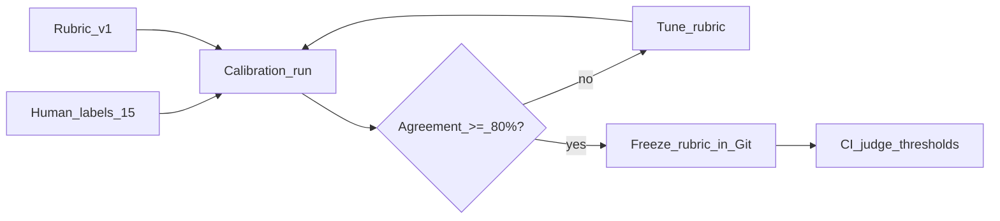

# LLM-as-Judge — Calibration & Bias

> Week 6 Theory · Day 4 · [← README](../README.md) · Prev: [layered-eval-pipeline](layered-eval-pipeline.md) · Next: [golden-datasets-trace-regression](golden-datasets-trace-regression.md)

RAGAS, DeepEval, and Promptfoo all use **LLM-as-judge** — another model scores whether an answer is good. Judges are useful but biased; Week 6 teaches **calibration** so scores mean something in CI.

---

## Concepts

### What problem are we solving?

If your judge always scores 0.9, thresholds are meaningless. If it favors verbose answers, you'll optimize for fluff. **Calibration** aligns judge scores with human labels on a labeled subset.

### Pointwise vs pairwise

| Method | How it works | Use when |
|--------|--------------|----------|
| **Pointwise** | Score one answer 0–1 against rubric | CI thresholds, RAGAS metrics |
| **Pairwise** | "Which answer is better, A or B?" | Model/prompt selection, A/B tests |
| **Reference-based** | Compare to gold answer | Golden dataset with exact expected text |

Pointwise is faster for CI. Pairwise is more reliable for close comparisons (research shows lower position bias when formatted correctly).

### Judge bias patterns

| Bias | Symptom | Mitigation |
|------|---------|------------|
| **Verbosity** | Longer answers score higher | Rubric: "Penalize unsupported detail" |
| **Self-preference** | GPT judge favors GPT outputs | Use different judge model than generator |
| **Position** | Pairwise: first answer wins | Swap order, average results |
| **Leniency drift** | Scores creep up over time | Re-calibrate monthly on frozen label set |
| **Anchoring** | All scores cluster 0.7–0.8 | Force rubric with explicit fail examples |

### Calibration workflow (Week 6 Lab 4)

1. Human-label 15–20 samples: `good` / `bad` / `partial`
2. Run pointwise judge with rubric v1
3. Compute **agreement rate** (judge good ↔ human good)
4. Target **≥80% agreement**; tune rubric if below
5. Freeze rubric version in Git (`eval/judge_rubric_v1.txt`)

### Worked example

| Sample | Human | Judge v1 | Judge v2 (tuned) |
|--------|-------|----------|------------------|
| Stipend $500 | good | 0.92 ✓ | 0.91 ✓ |
| Invented internet $ | bad | 0.78 ✗ | 0.41 ✓ |
| Vague "great benefits" | partial | 0.85 ✗ | 0.55 ✓ |

Rubric v2 added: *"Score ≤0.5 if any claim lacks context support."*

Agreement: v1 = 67% → v2 = 87% → ship v2 to CI.

### Sample judge prompt (faithfulness)

```
You evaluate whether ANSWER is fully supported by CONTEXT.

Scoring:
- 1.0: Every claim in ANSWER appears in CONTEXT
- 0.5: Partial support; some claims unsupported
- 0.0: ANSWER contradicts or invents facts not in CONTEXT

Penalize verbose padding. Short correct answers score high.

CONTEXT: {{context}}
ANSWER: {{answer}}

Respond JSON: {"score": 0.0-1.0, "reason": "..."}
```

### AI engineer takeaway

Never trust judge scores without calibration on **human-labeled** samples. Interview: *"We calibrate judges quarterly; separate judge model from generator; pairwise for model pick, pointwise for CI gates."*

---

## Architecture



---

## Tradeoffs

| Judge model | Pros | Cons |
|-------------|------|------|
| gpt-4o-mini | Cheap, fast | Weaker on subtle grounding |
| gpt-4o | Better calibration | 10× cost in CI |
| claude-3-5-haiku | Different bias profile | Second API dependency |
| Human only | Gold standard | Not automatable at scale |

---

## Best Practices

- Judge model **≠** generation model when possible
- Store rubric in Git, version with eval reports
- Log judge `reason` field for failed samples — debug rubric not just score
- Re-calibrate when switching judge model or major prompt change

---

## Common Mistakes

- Single global threshold (0.7) for all question types — negatives need different rubric
- Calibrating once on 5 samples — too small, overfits
- Pairwise without order swap — position bias skews model selection
- Treating judge score as ground truth in legal/compliance contexts

---

## Checkpoint

1. Pointwise vs pairwise — when use each?
2. Judge scores 0.78 on an answer human labeled "bad" — what do you do?
3. Why use a different model for judge vs generator?

> **Answers:** (1) Pointwise for CI thresholds; pairwise for A/B model selection. (2) Tune rubric; check for verbosity bias. (3) Reduces self-preference bias.

---

## Go Deeper

| Resource | Why |
|----------|-----|
| [G-Eval paper](https://arxiv.org/abs/2303.16634) | LLM-as-judge foundations |
| [Lab 4](../labs/lab-04-llm-judge-calibration.md) | Calibration hands-on |

---

## Next

→ [golden-datasets-trace-regression](golden-datasets-trace-regression.md) · [Lab 4](../labs/lab-04-llm-judge-calibration.md)
