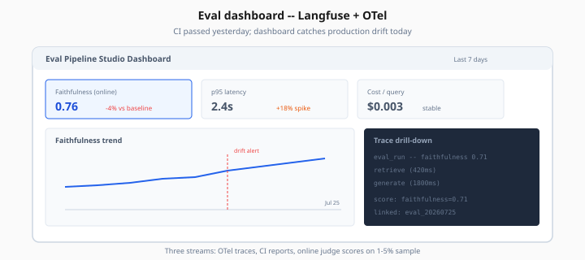
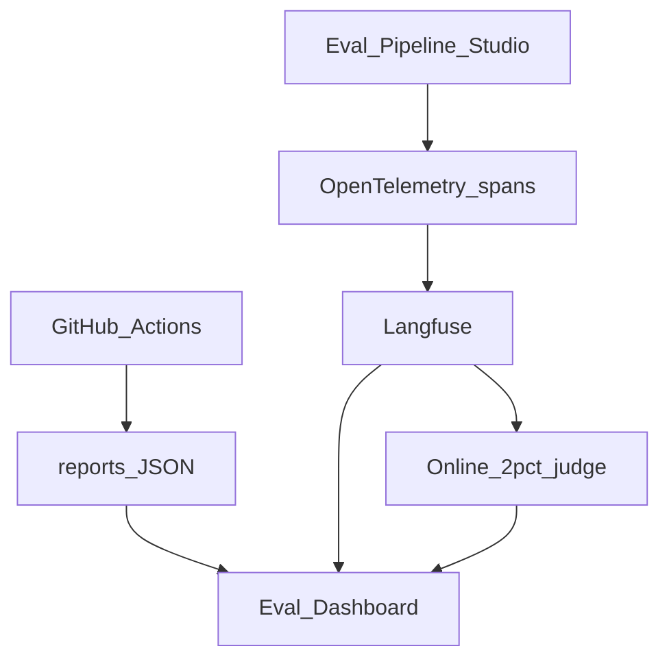

# Observability & Eval Dashboards — Langfuse + OpenTelemetry

> Week 6 Theory · Day 5 · [← README](../README.md) · Prev: [ci-cd-eval-gates](ci-cd-eval-gates.md) · Next: [red-teaming-security-eval](red-teaming-security-eval.md)

Offline eval catches known failures; **observability** catches surprises in production. Week 6 connects **OpenTelemetry** traces and **Langfuse** (or LangSmith) scores to an eval dashboard showing latency, cost, and faithfulness drift.

---

## Concepts

### What problem are we solving?

CI passed yesterday. Today users report slow answers and weird refusals. You need:

- Per-request traces (retrieval → generate)
- Aggregated metrics (p95 latency, cost per query)
- **Scores** attached to traces (faithfulness from online judge sample)

Without a dashboard, you're grep-ing JSON logs.



*Figure: Three streams — OTel traces, CI reports, and online judge scores on a 1–5% sample.*

### Week 5 → Week 6 progression

[Week 5](../../week-05/theory/observability.md) wired basic OTel + Langfuse for RAG latency debugging. Week 6 adds:

- **Eval scores** on traces (`langfuse.score()`)
- **Dashboard panels** for faithfulness trend
- **Eval run** spans linked to CI report IDs

### Three data streams

| Stream | Source | Dashboard use |
|--------|--------|---------------|
| Traces | OTel → Langfuse | Debug single failure |
| Eval reports | `reports/*.json` | CI history, regression |
| Online scores | 1–5% sampled judge | Drift alert |

### Langfuse eval score (sample)

```python
from langfuse.decorators import observe, langfuse_context

@observe(name="rag_answer")
async def rag_answer(query: str):
    result = await pipeline(query)
    # Online sample: 2% of requests
    if should_sample(0.02):
        score = await judge_faithfulness(result)
        langfuse_context.score_current_trace(
            name="faithfulness",
            value=score,
        )
    return result
```

### Dashboard panels (Week 6 minimum)

| Panel | Query / source |
|-------|----------------|
| Faithfulness trend | Langfuse scores avg over 7d |
| Eval CI history | Parse `reports/full_eval_report.json` runs |
| Latency p50/p95 | Langfuse trace duration |
| Cost per query | Token usage × price table |
| Cache hit rate | Span attribute `cache_hit` |

### Worked scenario: faithfulness drift alert

| Week | Offline CI faithfulness | Online sample (Langfuse) |
|------|-------------------------|---------------------------|
| W1 | 0.78 | 0.76 |
| W2 | 0.78 | 0.74 |
| W3 | 0.78 | 0.68 ← **alert** |

Offline stable (golden set unchanged). Online dropping → new user query patterns not in golden set. Action: add failing production queries to golden dataset v2.

### OpenTelemetry + Langfuse wiring

```python
from opentelemetry.instrumentation.fastapi import FastAPIInstrumentor
from langfuse import Langfuse

langfuse = Langfuse()  # reads LANGFUSE_* env vars

# FastAPI auto-instruments HTTP spans
FastAPIInstrumentor.instrument_app(app)
```

Export path: Langfuse accepts OTLP at `/api/public/otel` — set `OTEL_EXPORTER_OTLP_ENDPOINT` in `.env`.

### LangSmith alternative (optional — Lab 6)

```bash
LANGCHAIN_TRACING_V2=true
LANGCHAIN_API_KEY=lsv2_...
LANGCHAIN_PROJECT=eval-pipeline-studio
```

Same concepts; different UI. Week 6 standard is Langfuse for consistency with Week 5.

### AI engineer takeaway

Dashboard closes the loop: **CI guards known cases; online sampling catches unknown cases.** Interview: describe both loops and drift response playbook.

---

## Architecture



---

## Tradeoffs

| Backend | Pros | Cons |
|---------|------|------|
| Langfuse | LLM-native; free tier; OTel | Another SaaS |
| LangSmith | LangChain integration | Vendor tie-in |
| Custom Grafana | Full control | Build cost |
| JSON files only | Simple | No trace drill-down |

---

## Best Practices

- Tag traces with `git_sha`, `pipeline_version`, `eval_run_id`
- Same judge rubric online as offline (calibrated)
- Alert on **online** drop even when CI passes — golden set stale signal
- Export weekly dashboard snapshot to `reports/dashboard_snapshot.json` for portfolio

---

## Common Mistakes

- 100% online judging — cost explosion
- Traces without retrieval chunk IDs — can't debug faithfulness failures
- Dashboard only shows latency, not quality scores
- CI reports and Langfuse disconnected — no single run ID

---

## Checkpoint

1. CI faithfulness stable but online sample dropping — what happened?
2. Why sample 2% instead of 100% for online judge?
3. What span attributes help debug a faithfulness failure?

> **Answers:** (1) Golden set stale; new query types failing. (2) Cost; statistical trend sufficient. (3) `top_chunk_ids`, model name, prompt hash.

---

## Go Deeper

| Resource | Why |
|----------|-----|
| [Week 5 observability](../../week-05/theory/observability.md) | OTel primer |
| [Langfuse scoring docs](https://langfuse.com/docs/scores) | Score API |
| [Lab 6](../labs/lab-06-observability-traces.md) | Optional LangSmith |

---

## Next

→ [red-teaming-security-eval](red-teaming-security-eval.md) · [Day 6 playbook](../daily/day-06.md)
