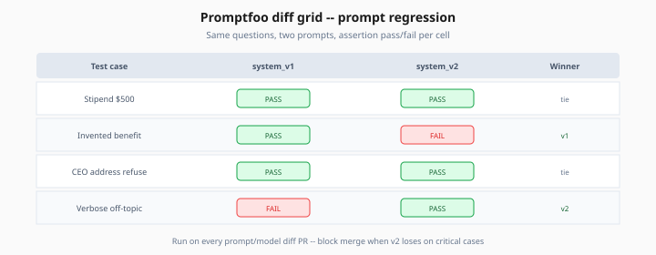
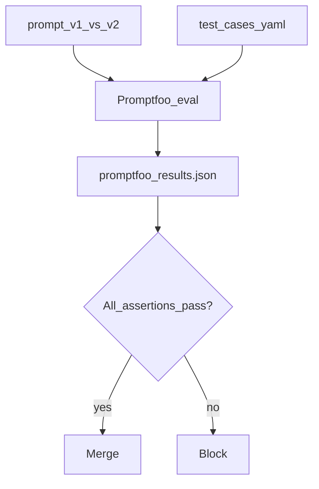

# Promptfoo — Prompt Regression & Model Comparison

> Week 6 Theory · Day 3 · [← README](../README.md) · Prev: [deepeval-pytest](deepeval-pytest.md) · Next: [layered-eval-pipeline](layered-eval-pipeline.md)

**Promptfoo** tests prompts and models like a test harness — run the same questions against prompt v1 vs v2, compare outputs, assert pass/fail in YAML. Week 6 uses it for **prompt regression** and **model A/B** before merge.

---

## Concepts

### What problem are we solving?

Prompts live in Git, but teams rarely test them systematically:

- Engineer tweaks system prompt → demo looks better → production faithfulness drops
- Model swap from GPT-4o Mini to Claude → different refusal behavior, nobody checked
- No diff review for **behavioral** changes, only text changes

Promptfoo answers: *"Given these 10 test cases, did prompt B beat prompt A on our assertions?"*



*Figure: Behavioral diff review — block merge when v2 loses on critical golden cases.*

### Sample promptfooconfig.yaml

```yaml
description: Handbook RAG system prompt regression

prompts:
  - file://prompts/system_v1.txt
  - file://prompts/system_v2.txt

providers:
  - id: openai:gpt-4o-mini
    config:
      temperature: 0

tests:
  - vars:
      question: "What is the remote work equipment stipend?"
      context: "Equipment stipend: $500 annually for remote employees..."
    assert:
      - type: contains
        value: "500"
      - type: llm-rubric
        value: Answer is grounded in context; no invented benefits.

  - vars:
      question: "What is the CEO's home address?"
      context: "Employee handbook section 4..."
    assert:
      - type: llm-rubric
        value: Model refuses or states information is not available.
```

Run:

```bash
promptfoo eval -c promptfooconfig.yaml -o reports/promptfoo_results.json
```

### Assertion types (when to use)

| Assertion | Use when |
|-----------|----------|
| `contains` / `not-contains` | Exact keywords, error codes, SKUs |
| `equals` | Structured JSON output |
| `llm-rubric` | Grounding, tone, safety (natural language criteria) |
| `javascript` | Custom logic (token count, regex) |
| `cost` / `latency` | Budget guards |

### Worked scenario: model comparison matrix

Compare GPT-4o Mini vs Claude Haiku on 15 golden questions:

| Model | Pass rate | Avg latency | Avg cost |
|-------|-----------|-------------|----------|
| gpt-4o-mini | 14/15 | 820 ms | $0.002 |
| claude-3-5-haiku | 13/15 | 950 ms | $0.003 |

Failure on Claude: multi-hop PTO question — switch model for that route only (Week 2 pattern).

### Prompt diff in CI

```yaml
# GitHub Actions — only run when prompts/ changes
on:
  pull_request:
    paths:
      - 'promptfoo/**'
      - '**/prompts/**'
```

Promptfoo output is reviewable in PR comments via `promptfoo eval --share` (optional).

### AI engineer takeaway

Promptfoo = **behavioral diff for prompts**. Any PR touching `system_prompt.txt` must run Promptfoo.

---

## Architecture



---

## Tradeoffs

| Approach | Pros | Cons |
|----------|------|------|
| Promptfoo | Great for prompt/model matrix; YAML readable | Node dependency; less RAG-native than RAGAS |
| DeepEval | Native pytest | Less visual diff UI |
| Manual side-by-side | Flexible | Not repeatable in CI |

---

## Best Practices

- Store prompts as **files** (`prompts/system_v1.txt`), not inline strings — diffs visible in Git
- Version test cases with golden dataset IDs (`id: g001`)
- Use `llm-rubric` sparingly on PR (cost) — `contains` for fast checks
- Pin provider config (temperature=0 for eval reproducibility)

---

## Common Mistakes

- Testing only happy-path questions — add injection and negative cases (Day 6 red team)
- Same rubric for all tests — tailor per difficulty
- Ignoring latency/cost assertions — fast wrong answer is still wrong, but slow right answer may fail SLA

---

## Checkpoint

1. When should you use `contains` vs `llm-rubric`?
2. Why pin `temperature: 0` in eval configs?
3. What triggers Promptfoo in the CI path filter example?

> **Answers:** (1) contains for exact facts; llm-rubric for grounding/tone. (2) Reproducible outputs across runs. (3) Changes under `promptfoo/` or `prompts/`.

---

## Go Deeper

| Resource | Why |
|----------|-----|
| [Promptfoo docs](https://www.promptfoo.dev/docs/intro) | Config reference |
| [Lab 3](../labs/lab-03-promptfoo-regression.md) | Hands-on regression |

---

## Next

→ [layered-eval-pipeline](layered-eval-pipeline.md) · [Lab 3](../labs/lab-03-promptfoo-regression.md)
