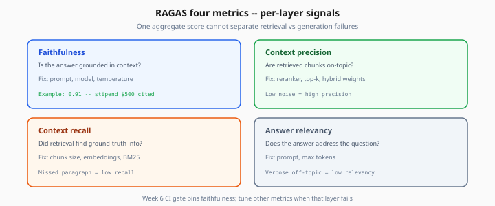
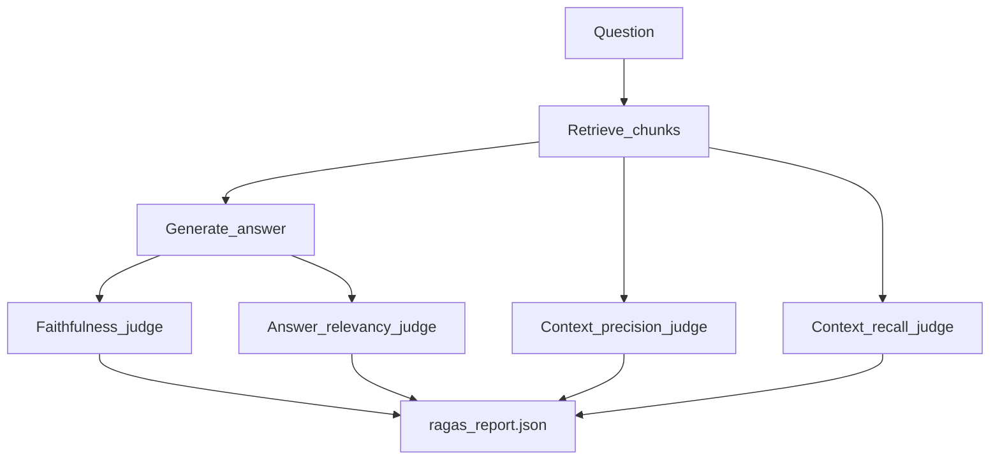

# RAGAS Metrics — Deep Dive

> Week 6 Theory · Day 2 · [← README](../README.md) · Prev: [why-eval-matters](why-eval-matters.md) · Next: [deepeval-pytest](deepeval-pytest.md)

**RAGAS** scores how well your RAG pipeline retrieves and generates — faithfulness, context quality, and answer relevancy — using LLM judges. Week 6 uses it as the **slow layer** baseline for Eval Pipeline Studio.

---

## Concepts

### What problem are we solving?

A RAG pipeline has three failure modes:

1. **Retrieval miss** — right doc exists, wrong chunk returned
2. **Generation drift** — good chunks, model adds unsupported claims
3. **Irrelevant answer** — verbose or off-topic despite good retrieval

One number ("accuracy") cannot separate these. RAGAS gives **per-layer signals**.

### Metric table (plain English)

| Metric | Question it answers | Fix lever |
|--------|---------------------|-----------|
| **Faithfulness** | Is the answer grounded in retrieved context? | Prompt, model, temperature |
| **Context precision** | Are retrieved chunks on-topic (low noise)? | Reranker, top-k, hybrid weights |
| **Context recall** | Did retrieval find ground-truth info? | Chunk size, embeddings, BM25 |
| **Answer relevancy** | Does the answer address the question? | Prompt, max tokens |

*Figure: Per-layer signals — tune retrieval when recall/precision drop; tune prompt when faithfulness drops.*

### Worked example

Question: *"What is the remote work equipment stipend?"*

Retrieved chunk: `"Equipment stipend: $500 annually for remote employees..."`

| Generated answer | Faithfulness | Why |
|------------------|--------------|-----|
| "$500 annually for eligible remote employees." | **High (~0.9)** | Fully supported by chunk |
| "$500 annually, plus $200 for internet." | **Low (~0.3)** | Internet $ not in chunk |
| "We offer competitive benefits packages." | **Medium** | Vague but not contradictory |

Action: low faithfulness → tighten system prompt: *"Only state facts present in context."*

### Numeric walkthrough (illustrative)

Golden set: 30 samples · GPT-4o Mini judge · ~$0.04 per sample

| Run | Faithfulness | Context recall | Cost |
|-----|--------------|----------------|------|
| Baseline (hybrid v1) | 0.78 | 0.71 | $1.20 |
| After chunk 256→512 | 0.81 | 0.76 | $1.20 |
| After prompt tweak (bad) | 0.62 | 0.74 | $1.20 |

Recall improved with bigger chunks; bad prompt hurt faithfulness despite same retrieval — **RAGAS isolates the layer**.

### RAGAS pipeline

### Week 6 thresholds

| Metric | CI warn | CI fail |
|--------|---------|---------|
| Faithfulness | Drop > 3% vs baseline | Drop > 5% vs baseline |
| Context recall | Drop > 5% | Drop > 8% |
| Answer relevancy | Drop > 5% | Drop > 10% |

Faithfulness is the **primary gate** — hallucinations are user-facing incidents.

### AI engineer takeaway

When faithfulness drops but recall is stable → **generation problem**. When recall drops but faithfulness stable → **retrieval problem**. Don't tune prompts when you need better embeddings.

---

## Tradeoffs

| Approach | Pros | Cons |
|----------|------|------|
| RAGAS LLM judges | Fast to adopt; RAG-native | Judge bias; API cost |
| Retrieval-only (MRR, hit@k) | Cheap | Ignores hallucinations |
| Exact match on answer | Deterministic | Too brittle for paraphrases |
| Human eval | Gold standard | Doesn't run in CI |

---

## Best Practices

- Log `embedding_model`, `chunk_strategy`, `pipeline_version` with every report
- Run on **≥30 samples** minimum for stable aggregates (Week 6); 50+ for production
- Include **negative questions** (unanswerable) — success = refusal, not fabrication
- Compare runs with same golden set only — changing golden set invalidates trend lines

---

## Common Mistakes

- Optimizing answer relevancy while faithfulness crashes (friendly hallucinations)
- Using GPT-4 as judge in CI while production uses GPT-4o Mini (calibration drift)
- One-shot eval before launch, never again
- Golden `ground_truth_contexts` that don't match indexed chunks

---

## Checkpoint

1. Faithfulness is 0.55, context recall is 0.80 — which layer do you fix first?
2. What does context precision measure vs context recall?
3. Why include negative (unanswerable) questions in the golden set?

> **Answers:** (1) Generation/prompt — retrieval finds info but answer isn't grounded. (2) Precision = retrieved chunks relevant; recall = ground-truth info was retrieved. (3) Detects hallucination when answer should be "I don't know."

---

## Go Deeper

| Resource | Why |
|----------|-----|
| [RAGAS docs](https://docs.ragas.io/) | Metric definitions + API |
| [Week 3 RAGAS intro](../../week-03/theory/rag-evaluation-ragas.md) | Golden dataset design |
| [Lab 1](../labs/lab-01-ragas-baseline.md) | Hands-on baseline |

---

## Next

→ [deepeval-pytest](deepeval-pytest.md) · [Lab 2](../labs/lab-02-deepeval-tests.md)
