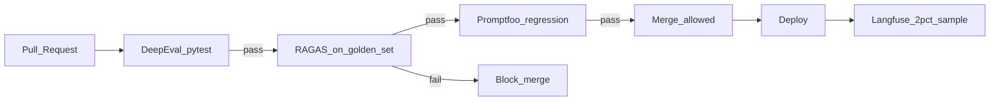

# Why Evaluation Is the #1 Production Readiness Signal

> Week 6 Theory · Day 1 · [← README](../README.md) · Next: [ragas-metrics](ragas-metrics.md)

You can demo an LLM app in an hour. Knowing it **won't embarrass you in production** takes evaluation — automated tests on real questions with measurable pass/fail gates. Week 6 treats eval as seriously as unit tests in traditional software.

---

## Concepts

### What problem are we solving?

Teams ship RAG chatbots that "feel fine" in demos, then fail in production:

- Answers invent policy details not in the handbook
- Retrieval misses the right paragraph after a prompt tweak
- Latency doubles after a model swap — nobody notices until users complain

**Evaluation** answers: *"Did we make things better or worse?"* with numbers, not opinions.

### Offline vs online evaluation

| Type | When | Data | Example |
|------|------|------|---------|
| **Offline** | Before deploy, in CI | Golden dataset (fixed Q&A pairs) | RAGAS faithfulness ≥ 0.75 on 30 samples |
| **Online** | After deploy, in production | Live traffic sample (1–5%) | Langfuse score on random requests; alert if faithfulness drifts |

**Offline** catches regressions before users see them. **Online** catches problems your golden set missed (new user phrasing, seasonal queries).

Both are required for production readiness — offline alone is not enough long-term.

### Worked scenario: the silent regression

Monday: engineer changes system prompt from "Answer from context only" to "Be helpful and concise."

Demo looks great — answers are shorter and friendlier.

Tuesday CI: **skipped** (no eval gate).

Wednesday support: 12 tickets — "Bot told me PTO is unlimited" (not in docs).

**With eval:** Promptfoo runs on PR → faithfulness drops 0.81 → 0.62 → merge blocked.

### Why eval beats manual QA

| Manual QA | Automated eval |
|-----------|----------------|
| 10 minutes per release | 5 minutes unattended in CI |
| Same tester bias every time | Golden set covers edge cases you forget |
| "Looks good" | Faithfulness 0.78 ± 0.03 with history |
| Doesn't scale with prompt changes | Every prompt diff triggers regression run |

### Production readiness signals (ranked)

1. **Golden dataset + CI gate** — blocks known regressions
2. **Observability traces** — debug failures you didn't predict ([Week 5](../../week-05/theory/observability.md))
3. **Red team suite** — security failures before attackers find them
4. **Online sampling + drift alerts** — catches slow degradation
5. **Human review** — gold standard but doesn't scale

Interview answer: *"We don't ship without offline eval on a golden set; CI fails if faithfulness drops more than 5%. Production samples 2% to Langfuse for drift."*

### AI engineer takeaway

Eval is how you **earn the right to deploy daily**. Without it, every prompt change is a coin flip.

---

## Architecture: eval in the release path

---

## Tradeoffs

| Approach | Pros | Cons |
|----------|------|------|
| Eval in CI | Fast feedback, team habit | API cost per PR; flaky judges |
| Nightly full eval | Cheaper per PR | Regressions found late |
| Human-only review | Highest trust | Slow; doesn't catch subtle drift |
| No eval | Ship fast | Production incidents |

---

## Best Practices

- Start with **30 golden pairs** — expand over time, never shrink without reason
- Pin **baseline scores** when eval gate goes live; update baseline intentionally, not silently
- Separate **fast** tests (DeepEval on 5 samples, <2 min) from **slow** tests (full RAGAS, nightly)
- Log **pipeline version** with every eval run (embedding model, chunk size, prompt hash)

---

## Common Mistakes

- Golden answers written by GPT without source verification → eval optimizes for hallucinations
- One metric only (e.g. answer relevancy) while ignoring faithfulness
- CI gate without baseline → arbitrary thresholds that block good PRs or pass bad ones
- Skipping eval because "we're pre-production" — habits form early

---

## Checkpoint

1. What is the difference between offline and online eval?
2. Why did faithfulness drop in the silent regression scenario?
3. Name two production readiness signals ranked above manual QA alone.
4. What should happen on a PR when faithfulness drops 8% vs baseline?

> **Answers:** (1) Offline = pre-deploy golden set; online = production sampling. (2) Shorter prompt encouraged helpful hallucinations. (3) Golden dataset + CI gate; observability traces. (4) CI blocks merge (assuming 5% threshold).

---

## Go Deeper

| Resource | Why |
|----------|-----|
| [OpenAI Evals guide](https://platform.openai.com/docs/guides/evals) | Official eval framing |
| [Hamid Palangi — LLM eval blog series](https://hamel.dev/) | Practitioner patterns |
| [Week 3 RAGAS intro](../../week-03/theory/rag-evaluation-ragas.md) | RAG-specific metrics primer |

---

## Next

→ [Lab 1](../labs/lab-01-ragas-baseline.md) · mark [Day 1](../daily/day-01.md) done · [Day 2 playbook](../daily/day-02.md) → [ragas-metrics](ragas-metrics.md)
