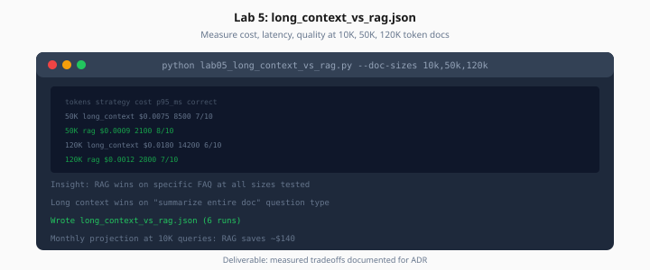

# Lab 5: Long Context vs RAG Benchmark

> Week 7 Labs · [← README](README.md) · [Long Context Theory](../theory/long-context-vs-rag.md)

> **Work path:** `~/ai-learning/week-07-work/`

**Estimated cost:** $1–4 (large prefill calls — use 1–2 doc sizes if budget tight)

**Goal:** Measure cost, latency, quality for stuff-doc vs RAG on same questions.



*Figure: Same questions, two strategies — document measured cost and latency for your ADR.*

---

## Task

Prepare synthetic or real docs at **10K**, **50K**, **120K** token sizes (or nearest available):

```bash
python lab05_prepare_longdocs.py --sizes 10000,50000,120000 --source data/corpus/
python lab05_long_context_vs_rag.py \
  --doc-sizes 10k,50k,120k \
  --questions data/golden/longdoc.jsonl \
  --output long_context_vs_rag.json
```

### Expected output: `long_context_vs_rag.json`

```json
{
  "runs": [
    {
      "doc_tokens": 50000,
      "strategy": "long_context",
      "avg_input_tokens": 50200,
      "avg_cost_usd": 0.0075,
      "p95_latency_ms": 8500,
      "correct": 7,
      "total": 10
    },
    {
      "doc_tokens": 50000,
      "strategy": "rag_top8",
      "avg_input_tokens": 8200,
      "avg_cost_usd": 0.0012,
      "p95_latency_ms": 2400,
      "correct": 8,
      "total": 10
    }
  ],
  "crossover_note": "RAG cheaper from 10K+; long context wins on full-doc summary question only"
}
```

Include at least one **holistic summary** question where long context may win.

---

## Acceptance

- [ ] ≥2 doc sizes tested (3 recommended)
- [ ] Both strategies measured on same question set
- [ ] Token counts and cost included
- [ ] `crossover_note` documents when to pick each strategy

---

## Next

[Day 6](../daily/day-06.md) → [Lab 6](lab-06-mcp-production.md)
