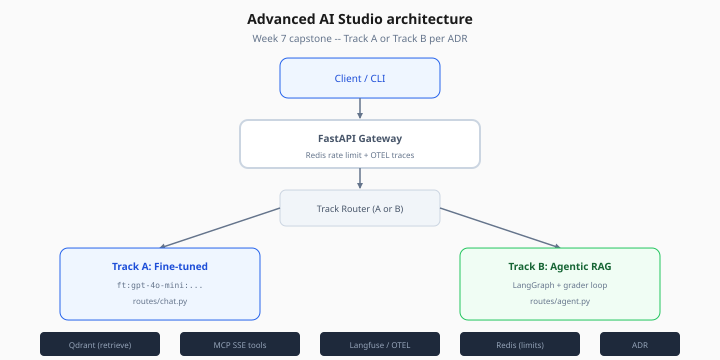
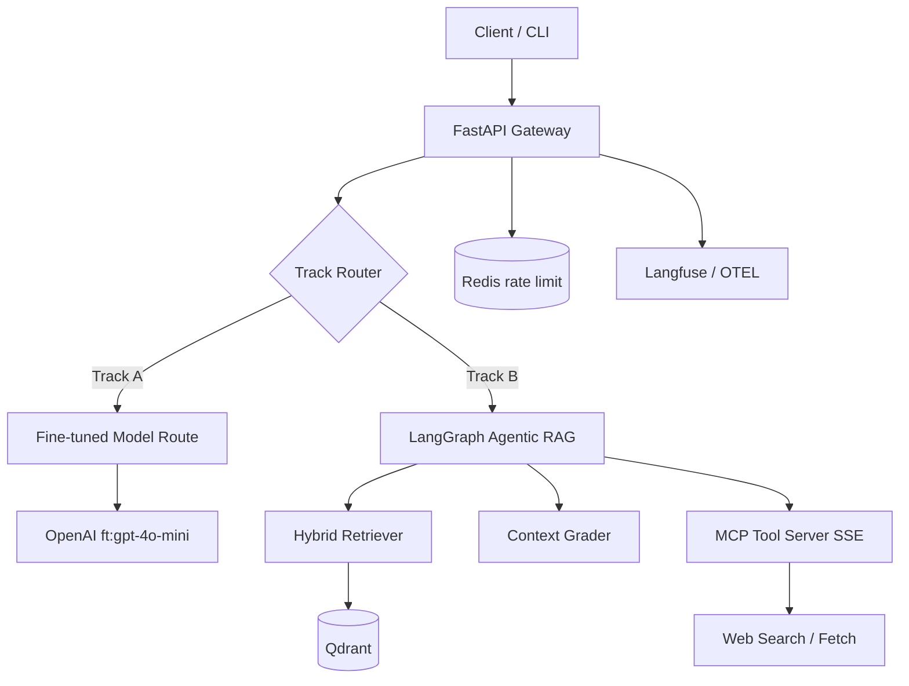

# Advanced AI Studio — Architecture

> Week 7 Project · [← Overview](overview.md) · [Backend](backend.md)

## System diagram



*Figure: FastAPI gateway routes to Track A (ft: model) or Track B (LangGraph + Qdrant + MCP) per ADR.*



## Folder structure

```
advanced-ai-studio/
├── docker-compose.yml
├── docs/
│   └── adr/
│       └── 0001-advanced-ai-studio.md
├── backend/
│   └── app/
│       ├── main.py
│       ├── config.py
│       ├── routes/
│       │   ├── chat.py          # Track A
│       │   └── agent.py         # Track B
│       ├── models/
│       │   └── router.py        # Fine-tuned vs baseline fallback
│       ├── graph/
│       │   └── agentic_rag.py   # Track B LangGraph
│       ├── retrieval/           # Week 3 carry-over
│       ├── mcp/
│       │   └── production_server.py
│       └── eval/
│           └── capstone_eval.py
└── data/
    └── golden/
```

## Configuration

`ADVANCED_STUDIO_TRACK=A|B` in `.env` selects primary route. Both codepaths may exist; capstone validates **one** fully.

## Observability

- Trace ID on every request
- LangGraph step events for Track B (`retrieve`, `grade`, `rewrite`)
- Fine-tune model ID logged on Track A responses

## Security

- MCP API key auth (Day 6)
- Cost cap middleware from Week 5
- No training data or API keys in client requests

[← Overview](overview.md) · [Track A](track-a-finetuned-assistant.md) · [Track B](track-b-agentic-rag.md)
