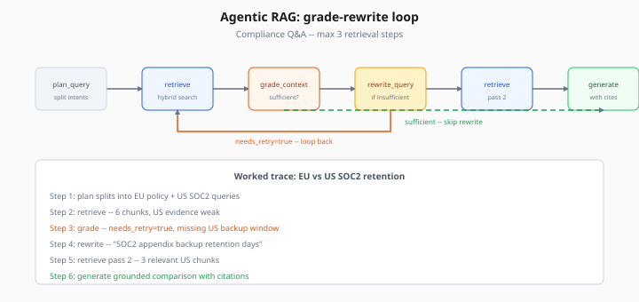
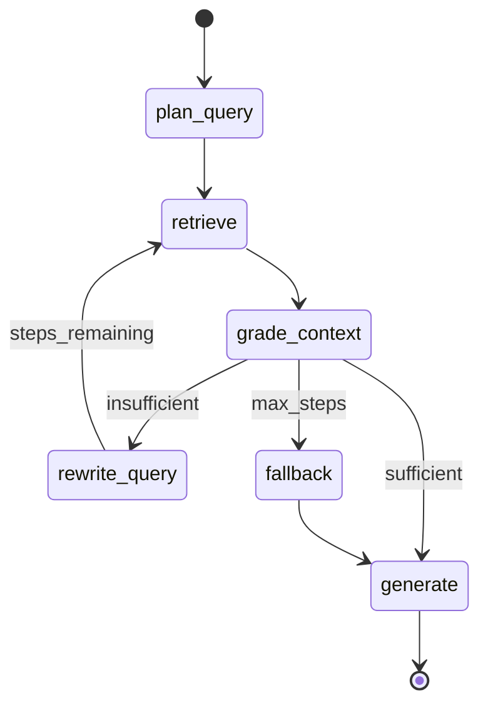

# Agentic RAG — Full Integration

> Week 7 Theory · Day 4 · [← README](../README.md) · Prev: [distillation-small-models](distillation-small-models.md) · Next: [long-context-vs-rag](long-context-vs-rag.md)

**Classic RAG** runs one retrieval, then generates. **Agentic RAG** puts an LLM agent in charge: it can rewrite the query, retrieve again, call tools, or stop when context is good enough. Week 3 previewed the idea; Week 7 ships the full LangGraph integration for **Advanced AI Studio** Track B.

---

## Concepts

### What problem are we solving?

Single-shot retrieval fails on **multi-hop** questions, **ambiguous acronyms**, and **stale first results**. An agent loop treats retrieval as a tool it uses iteratively — like a researcher checking multiple indexes before writing.

### Worked scenario: compliance Q&A

Query: *"Does our EU data retention policy allow the same backup window as the US SOC2 appendix?"*

| Step | Node | Action | Outcome |
|------|------|--------|---------|
| 1 | `plan_query` | Split into EU policy + US SOC2 | Two search intents |
| 2 | `retrieve` | Hybrid search each | 6 chunks, EU strong, US weak |
| 3 | `grade_context` | LLM grader: "US evidence insufficient" | `needs_retry=true` |
| 4 | `rewrite_query` | "SOC2 appendix backup retention days" | Refined query |
| 5 | `retrieve` | Second pass | 3 relevant US chunks |
| 6 | `generate` | Answer with citations | Grounded comparison |

Without iteration, step 2 alone might answer only the EU half.



*Figure: Grade context after each retrieve — insufficient evidence triggers rewrite and a second search before generate.*

### Classic vs agentic (Week 7 production)

| | Classic RAG (Week 3) | Agentic RAG (Week 7) |
|---|----------------------|----------------------|
| Control flow | Fixed pipeline | LangGraph state machine |
| Retrievals | 1 | 1–4 (configurable max) |
| Tools | Optional bolt-on | First-class MCP tools + retrieve |
| Latency | Lower | 2–4× typical |
| Eval | Faithfulness on single hop | Multi-hop golden set |

### LangGraph architecture



**State object (sketch):**

```python
class AgenticRAGState(TypedDict):
    question: str
    queries: list[str]
    chunks: list[Document]
    retrieval_step: int
    grade: Literal["sufficient", "insufficient", "max_steps"]
    answer: str
    citations: list[str]
```

### Grader options

| Grader | Pros | Cons |
|--------|------|------|
| **LLM yes/no** | Flexible | Extra token cost |
| **Rerank score threshold** | Fast | Misses semantic " enough" |
| **RAGAS context precision** | Offline eval aligned | Slow for online loop |

Week 7 lab uses LLM grader with structured output `{sufficient: bool, missing: string}`.

### MCP + agentic RAG

When docs lack live data, agent calls MCP tools (metrics API, ticket system) **between** retrieval steps — Week 6 production patterns apply to those servers.

### AI engineer takeaway

Cap **`max_retrieval_steps`** (default 3) and log each step to Langfuse. Interview answer: agentic RAG trades latency for recall on multi-hop — show trace JSON proving it.

---

## Tradeoffs

| | Agentic RAG | Classic RAG |
|---|-------------|-------------|
| Multi-hop quality | Strong | Weak |
| Cost | Higher (multiple embed + LLM calls) | Lower |
| Debuggability | Need step traces | Simpler |
| Failure mode | Infinite loop if no cap | Wrong chunk once |

---

## Best Practices

1. **Hard step limit** — prevent runaway loops.
2. **Dedupe chunks** by `doc_id + chunk_index` before generate.
3. **Expose trace** in API response for debugging (`steps[]`).
4. **Fallback** to classic RAG if agent exceeds budget.
5. **Eval multi-hop set** separate from single-hop golden.

---

## Common Mistakes

| Mistake | Fix |
|---------|-----|
| Grader always says sufficient | Tune prompt; add missing-info field |
| Same query retried | Force rewrite node to change embedding |
| No citation in generate | System prompt requires `[doc_id]` format |
| Agent calls retrieve 10× | Enforce max steps + cost middleware |

---

## Checkpoint

1. What question type motivates agentic over classic RAG?
2. Name four LangGraph nodes in the Week 7 graph.
3. What does the grader return when US evidence is missing?
4. Why cap `max_retrieval_steps`?
5. How do MCP tools complement retrieval in the same agent?

---

## Go Deeper

| Resource | Why |
|----------|-----|
| [Week 3 agentic RAG preview](../../week-03/theory/agentic-rag-preview.md) | Earlier teaser |
| [LangGraph docs](https://langchain-ai.github.io/langgraph/) | State graphs |
| [Week 4 LangGraph theory](../../week-04/theory/langgraph.md) | Agent foundations |

---

## Next

**Lab:** [Lab 4 — Agentic RAG](../labs/lab-04-agentic-rag.md) → Day 4 done → [Day 5](../daily/day-05.md) → [long-context-vs-rag.md](long-context-vs-rag.md)
