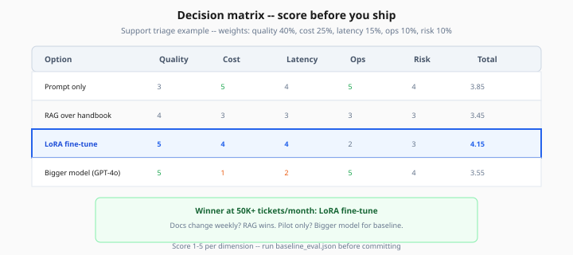
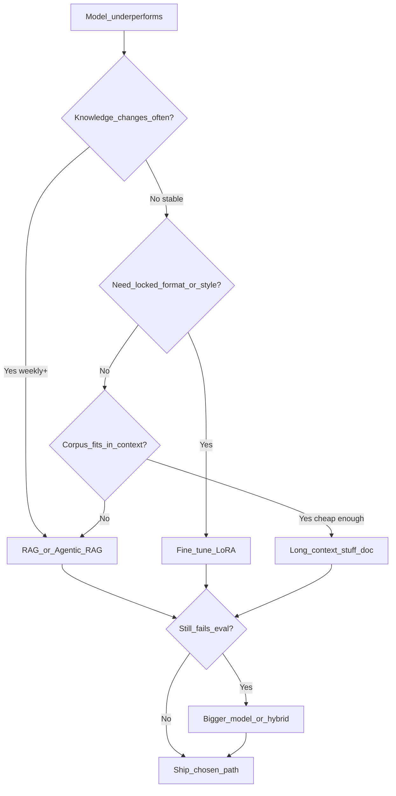

# Decision Framework — Fine-Tune vs RAG vs Prompt vs Bigger Model

> Week 7 Theory · Day 1 · [← README](../README.md) · Next: [lora-peft-finetuning](lora-peft-finetuning.md)

You have four levers when a base model underperforms: **better prompts**, **retrieval (RAG)**, **fine-tuning**, or **a larger model**. This page gives you a scoring framework so the choice is evidence, not hype.

---

## Concepts

### What problem are we solving?

Engineers default to "use GPT-4" or "fine-tune everything." Both waste money. You need a **repeatable decision** per use case: what changes (knowledge vs behavior), how often data updates, and what quality bar you must hit at what cost.

### Worked scenario: internal support triage

**Use case:** Classify tickets into `{billing, bug, feature_request}` and draft a first reply in company tone.

| Option | Setup effort | Inference cost | Stays fresh when docs change? | Fit for locked tone? |
|--------|--------------|----------------|-------------------------------|----------------------|
| Prompt only | Low | Low | Yes (if rules in prompt) | Medium |
| RAG over handbook | Medium | Medium | Yes | Medium |
| LoRA fine-tune on 500 past tickets | High | Low at scale | No — retrain needed | High |
| Bigger model (GPT-4o) | Low | High | Yes | High |

**Sample numbers (illustrative):**

- Prompt + RAG: 88% classification accuracy, $0.002/request
- Fine-tune on Mini: 94% accuracy, $0.0008/request after job
- GPT-4o prompt: 96% accuracy, $0.012/request

**Decision:** Fine-tune if volume > 50K tickets/month and taxonomy stable. RAG if policy docs change weekly. Bigger model for pilot only.

*Figure: Score all four levers on quality, cost, latency, ops, and risk — LoRA wins at high volume with stable taxonomy; RAG wins when docs change weekly.*

### Decision flowchart

### Scoring dimensions (Lab 1)

| Dimension | Weight | Measure |
|-----------|--------|---------|
| **Quality** | 40% | Golden set win rate / RAGAS faithfulness |
| **Cost** | 25% | $/1K requests at expected QPS |
| **Latency** | 15% | p95 end-to-end ms |
| **Ops burden** | 10% | Retrain frequency, index pipelines, on-call |
| **Risk** | 10% | PII in training, vendor lock-in, eval drift |

Score each option 1–5 per dimension; weighted sum picks default path. **Always keep a fallback** (e.g. RAG + fine-tune router).

### When each lever wins

| Lever | Wins when | Loses when |
|-------|-----------|------------|
| **Prompt engineering** | Quick iteration, small behavior change | Long rubrics overflow context |
| **RAG** | Facts in docs, updates frequently | Multi-hop without agent loop |
| **Fine-tune (LoRA)** | Stable domain, style/format locked, high volume | Knowledge changes weekly |
| **Bigger model** | Pilot, low volume, need max quality | Cost at scale, latency SLO |

### AI engineer takeaway

Interviewers ask "why not fine-tune?" — answer with **data freshness**, **eval numbers**, and **$/request at your QPS**. Week 7 Lab 1 produces the artifact.

---

## Hybrid patterns (common in production)

| Pattern | Description |
|---------|-------------|
| **RAG + fine-tuned generator** | Retrieve fresh facts; fine-tune teaches citation format |
| **Router cascade** | Cheap model first → escalate on low confidence |
| **Agentic RAG + tools** | Retrieve + call APIs when docs insufficient |
| **Long context for session, RAG for corpus** | Stuff conversation; retrieve product docs |

---

## Tradeoffs

| Strategy | Pros | Cons |
|----------|------|------|
| Prompt only | Fastest to ship | Brittle at scale |
| RAG | Fresh knowledge | Retrieval failures |
| Fine-tune | Cheap inference, consistent style | Stale knowledge, retrain cost |
| Bigger model | Highest ceiling | Cost, latency |

---

## Best Practices

1. **Baseline first** — measure prompt-only before adding complexity.
2. **Same golden set** for all options — apples-to-apples.
3. **Document decision** in an ADR — Week 7 capstone requires this.
4. **Re-eval quarterly** — model APIs and prices shift.

---

## Common Mistakes

| Mistake | Fix |
|---------|-----|
| Fine-tune to "add facts" | Use RAG; fine-tune behavior not encyclopedia |
| RAG everything including 2-page FAQ | Prompt or long context may suffice |
| Skip cost math | Include prefill tokens for long context |
| One eval question | Minimum 20–50 golden pairs |

---

## Checkpoint

1. Name two signals that favor RAG over fine-tuning.
2. In the support triage example, why might fine-tune beat GPT-4o at scale?
3. What four dimensions does Lab 1 score?
4. When is "stuff the whole doc" (long context) reasonable?
5. What hybrid pattern combines fresh facts with locked output format?

---

## Go Deeper

| Resource | Why |
|----------|-----|
| [OpenAI fine-tuning guide](https://platform.openai.com/docs/guides/fine-tuning) | API workflow |
| [Week 3 RAG eval](../week-03/theory/rag-evaluation-ragas.md) | Golden set patterns |
| [Week 1 training vs fine-tuning](../week-01/theory/training-vs-finetuning.md) | Foundation recap |

---

## Next

**Lab:** [Lab 1 — Decision Matrix](../labs/lab-01-decision-matrix.md) → mark Day 1 done → [Day 2 playbook](../daily/day-02.md) → [lora-peft-finetuning.md](lora-peft-finetuning.md)
