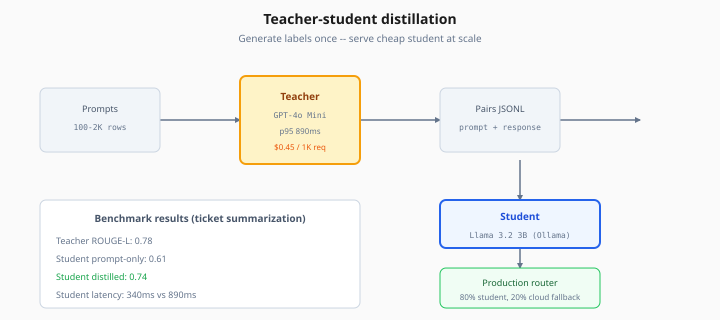
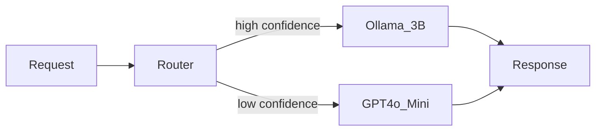

# Distillation & Small Model Deployment

> Week 7 Theory · Day 3 · [← README](../README.md) · Prev: [lora-peft-finetuning](lora-peft-finetuning.md) · Next: [agentic-rag](agentic-rag.md)

A **teacher model** (large, smart, expensive) generates training targets; a **student model** (small, fast, cheap) learns to mimic it. **Distillation** shrinks cost and latency while keeping most of the quality — critical when you outgrow cloud bills but don't need full frontier reasoning.

---

## Concepts

### What problem are we solving?

GPT-4o Mini at 2M requests/month might cost hundreds of dollars. A 3B parameter model on Ollama costs hardware only. Distillation asks: **can the small model match the teacher on *your* task distribution?**

### Worked scenario: ticket summarization

| Model | p95 latency | $/1K requests | ROUGE-L vs human |
|-------|-------------|---------------|------------------|
| GPT-4o (teacher) | 2100 ms | $4.20 | 0.82 |
| GPT-4o Mini | 890 ms | $0.45 | 0.78 |
| Llama 3.2 3B (prompt only) | 320 ms | ~$0 | 0.61 |
| Llama 3.2 3B (distilled on 2K teacher summaries) | 340 ms | ~$0 | 0.74 |

**Decision:** Route 80% traffic to distilled 3B; escalate to Mini when confidence < 0.7.

*Figure: Teacher labels once — distilled student closes most of the quality gap at ~340ms vs 890ms p95 latency.*

### Distillation methods (Week 7 scope)

| Method | How | Week 7 lab |
|--------|-----|------------|
| **Response distillation** | Teacher outputs → student SFT dataset | Lab 3 primary |
| **Logit distillation** | Match soft probabilities | Optional deep dive |
| **Fine-tune as distillation** | Same as SFT on teacher labels | OpenAI / LoRA path |

Lab 3 generates `(prompt, teacher_response)` pairs, fine-tunes or evaluates student.

### Deployment patterns for small models

| Deployment | Pros | Cons |
|------------|------|------|
| **Ollama (dev/small prod)** | Simple, local | Single-node scale |
| **vLLM / TGI** | High throughput GPU | Ops complexity |
| **Azure ML / Foundry** | Managed endpoints | Cost |

### Numeric walkthrough: break-even

- Teacher: $0.00045/request × 2M = **$900/month**
- GPU node for 3B: **$200/month** fixed
- Break-even ≈ 444K requests/month if student replaces teacher entirely

Add engineering time — distillation wins at **sustained volume** on **narrow tasks**.

### AI engineer takeaway

Show a **router + benchmark table** in system design interviews. Distillation is not magic — student fails on out-of-distribution questions; keep teacher fallback.

---

## Tradeoffs

| | Teacher cloud | Distilled local |
|---|---------------|-----------------|
| Quality ceiling | Highest | Task-dependent |
| Latency | Network + large model | Low local |
| Ops | API key | GPU, model updates |
| Privacy | Data leaves org | On-prem possible |

---

## Best Practices

1. **Match task distribution** — distill on real prompts, not generic chat.
2. **Confidence gating** — never 100% traffic to student without fallback.
3. **Re-distill when teacher updates** — version student checkpoints.
4. **Same eval harness** as Day 1 golden set.

---

## Common Mistakes

| Mistake | Fix |
|---------|-----|
| Distill general chat | Focus on one task (summarize, classify) |
| No latency measurement | Benchmark p50/p95 under load |
| Student on CPU for prod SLA | Quantize + GPU or accept slower TTFT |

---

## Checkpoint

1. What is the teacher's role in response distillation?
2. In the ticket example, why route only 80% to the 3B model?
3. Name two small-model deployment options.
4. At what monthly volume does a $200 GPU beat $0.00045/request API?
5. How does distillation differ from LoRA fine-tune on human labels?

---

## Go Deeper

| Resource | Why |
|----------|-----|
| [Distilling step-by-step (Google)](https://arxiv.org/abs/2203.02147) | Classic paper |
| [Ollama model library](https://ollama.com/library) | Pull small models |
| [vLLM docs](https://docs.vllm.ai/) | Production serving |

---

## Next

**Lab:** [Lab 3 — Distillation](../labs/lab-03-distillation-deploy.md) → Day 3 done → [Day 4](../daily/day-04.md) → [agentic-rag.md](agentic-rag.md)
