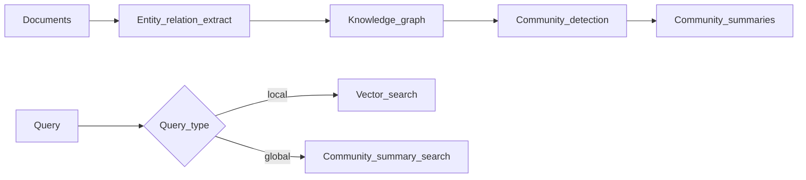

# GraphRAG Overview

> Week 7 Theory · Day 5 · [← README](../README.md) · **Optional — not required for Week 7 exit criteria**

> Prev: [long-context-vs-rag](long-context-vs-rag.md) · Next: [multimodal-preview](multimodal-preview.md)

**GraphRAG** builds a **knowledge graph** from your documents — entities, relationships, and **community summaries** — then retrieves through that graph for questions that need global or thematic understanding across many files. It complements vector RAG when "find similar chunk" misses the big picture.

---

## Concepts

### What problem are we solving?

Vector RAG excels at *local* facts ("What is the refund window?"). It struggles with *global* questions: *"What are the main themes in our 500 incident postmortems?"* or *"How do Team A's services depend on Team B across all architecture docs?"* GraphRAG precomputes structure so retrieval can jump to **communities** and **relationship paths**.

### Worked scenario: theme synthesis

**Corpus:** 200 engineering RFCs.

| Question type | Vector RAG | GraphRAG |
|---------------|------------|----------|
| "RFC-142 approval date" | Strong | Overkill |
| "Top 5 recurring reliability themes in Q3 RFCs" | Weak (random similar chunks) | Strong (community summary nodes) |
| "Which teams co-own payment APIs?" | Medium | Strong (entity edges) |

### Pipeline (Microsoft GraphRAG pattern)

1. **Index time:** LLM extracts entities/relations → graph → cluster communities → summarize each community.
2. **Query time:** Local questions hit vector + graph neighbors; global questions hit community summaries.

### GraphRAG vs agentic RAG

| | GraphRAG | Agentic RAG |
|---|----------|-------------|
| Index cost | High (batch LLM on full corpus) | Lower (standard chunk index) |
| Query cost | Medium | Higher (multiple agent steps) |
| Best for | Thematic / global synthesis | Multi-hop factual chains |
| Freshness | Rebuild graph on doc change | Re-index chunks faster |

Many production systems use **vector RAG + agentic loop** first; add GraphRAG when eval shows global questions fail.

### AI engineer takeaway

Mention GraphRAG in interviews for **"summarize across 10K docs"** scenarios — not for every FAQ bot. Optional Week 7 reading only.

---

## Tradeoffs

| Pros | Cons |
|------|------|
| Strong global queries | Expensive indexing |
| Explainable paths (A → relates → B) | Graph drift when docs update |
| Combines with vector search | Extra ops (Neo4j, GraphML, etc.) |

---

## Best Practices

1. **Pilot on subset** — 50 docs before 10K.
2. **Hybrid retrieve** — don't replace vector index entirely.
3. **Version graph** with corpus hash — rebuild on ingest job completion.

---

## Checkpoint (optional)

1. What query type favors GraphRAG over vector RAG?
2. What is a community summary?
3. Why is GraphRAG indexing expensive?

---

## Go Deeper

| Resource | Why |
|----------|-----|
| [Microsoft GraphRAG repo](https://github.com/microsoft/graphrag) | Reference implementation |
| [Neo4j + LLM guides](https://neo4j.com/labs/genai-ecosystem/) | Graph store options |

---

## Next

Optional skim only → continue required path: [long-context-vs-rag.md](long-context-vs-rag.md) → [Lab 5](../labs/lab-05-long-context-benchmark.md)
