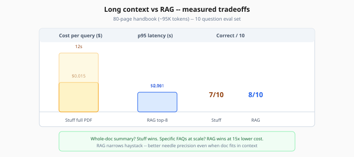
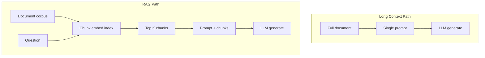

# Long Context vs RAG

> Week 7 Theory · Day 5 · [← README](../README.md) · Prev: [agentic-rag](agentic-rag.md) · Next: [graphrag-overview](graphrag-overview.md) *(optional)*

Modern models accept **128K–200K+ tokens** — enough to paste entire codebases or policy binders. **Long context** means stuffing the full document into the prompt; **RAG** retrieves only relevant chunks. This page helps you decide when retrieval is still worth the pipeline complexity.

---

## Concepts

### What problem are we solving?

Teams skip RAG because "the model fits the whole PDF now." That ignores **cost**, **latency**, and **needle-in-haystack** quality. You need measured tradeoffs, not marketing context windows.

### Worked scenario: 80-page employee handbook

| Strategy | Input tokens | Cost (GPT-4o Mini) | p95 latency | Answer quality (10 Q eval) |
|----------|--------------|--------------------|-------------|----------------------------|
| Stuff full PDF (~95K tokens) | ~98K | ~$0.015/query | 12s | 7/10 correct |
| RAG top-8 chunks (~6K tokens) | ~8K | ~$0.001/query | 2.1s | 8/10 correct |
| Long context + cite page | ~98K | ~$0.015/query | 11s | 9/10 on page-specific Q |

**Insight:** Full stuff wins on *"summarize entire handbook"*; RAG wins on *specific* FAQs at 15× lower cost.

*Figure: RAG wins on specific FAQs at 15× lower cost — full stuff only when you need whole-doc summary and cost is acceptable.*

### Needle-in-haystack

Benchmarks show models miss facts buried in huge contexts ("needle" test). RAG ** narrows** the haystack — often improving precision even when full doc fits.

### Decision table

| Signal | Prefer long context | Prefer RAG |
|--------|---------------------|------------|
| Doc size | Fits comfortably with output budget | Corpora many docs / GB scale |
| Query type | Holistic summary of one doc | Specific fact lookup |
| Cost sensitivity | Low QPS, pilot budget | High QPS |
| Freshness | Single static doc | Frequent updates |
| Latency SLO | Relaxed (>5s OK) | Strict (<3s) |

### Hybrid: "context cache" pattern

For a **session** working one doc:

1. First message: ingest + cache doc in provider context cache (where supported) or app-side KV.
2. Follow-ups: reuse cached prefix — amortize prefill cost.
3. Cross-doc questions: fall back to RAG index.

### Numeric walkthrough

Handbook 95K tokens, 10K queries/month:

- **Stuff:** 95K × 10K × $0.15/1M ≈ **$142/month** input alone
- **RAG:** 8K × 10K × $0.15/1M ≈ **$12/month** + embedding/index ops

At 100K queries/month, gap drives architecture.

### AI engineer takeaway

Lab 5 produces `long_context_vs_rag.json` — cite it in your ADR. Interview line: "We RAG until doc fits *and* QPS makes stuff cheaper — here are the numbers."

---

## Architecture comparison

---

## Tradeoffs

| | Long context | RAG |
|---|--------------|-----|
| Pipeline complexity | Low | High |
| Per-query cost (large doc) | High | Lower |
| Multi-document | Poor | Native |
| Summarize-one-doc | Excellent | Chunky |

---

## Best Practices

1. **Measure on your doc sizes** — not vendor benchmarks alone.
2. **Include prefill in latency** — TTFT spikes with huge context.
3. **Try RAG first** for corpora; long context for single-doc sessions.
4. **Agentic RAG** when one doc is huge *and* questions are multi-hop.

---

## Common Mistakes

| Mistake | Fix |
|---------|-----|
| Ignore output token budget | Reserve 2–4K for answer |
| Stuff 10 docs × 50K | RAG or GraphRAG |
| No comparison eval | Run Lab 5 harness |

---

## Checkpoint

1. In the handbook example, why does RAG cost less per query?
2. What is a "needle-in-haystack" failure?
3. When does stuffing the full PDF beat RAG on quality?
4. What hybrid pattern amortizes prefill for a single doc session?
5. At 10K queries/month on a 95K-token doc, which strategy is cheaper?

---

## Go Deeper

| Resource | Why |
|----------|-----|
| [Gemini long context](https://ai.google.dev/gemini-api/docs/long-context) | Provider limits |
| [Week 3 chunking](../../week-03/theory/chunking-strategies.md) | RAG baseline |

---

## Next

**Optional:** [graphrag-overview.md](graphrag-overview.md) · **Lab:** [Lab 5](../labs/lab-05-long-context-benchmark.md) → Day 5 done → [Day 6](../daily/day-06.md) → [multimodal-preview.md](multimodal-preview.md)
