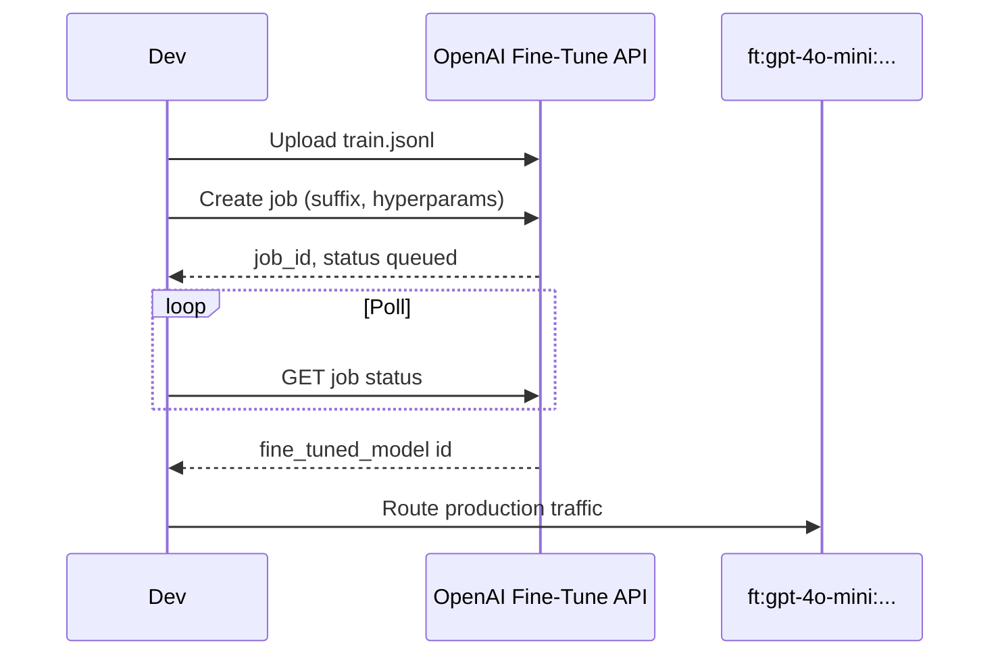

# LoRA / PEFT Fine-Tuning

> Week 7 Theory · Day 2 · [← README](../README.md) · Prev: [decision-framework](decision-framework.md) · Next: [distillation-small-models](distillation-small-models.md)

**Fine-tuning** updates a model's weights on your examples so it learns a task or style. **LoRA** (Low-Rank Adaptation) and **PEFT** (Parameter-Efficient Fine-Tuning) train a small adapter instead of the full billion-parameter matrix — making fine-tunes cheaper, faster, and easier to swap.

---

## Concepts

### What problem are we solving?

Full fine-tuning of a 7B model might update billions of weights and need multiple GPUs. LoRA adds tiny trainable matrices beside frozen layers — you get most of the behavior change for **~0.1–1%** of trainable parameters.

### Concrete example: release-notes tone

**Goal:** Every changelog entry follows: `## Summary` → `### Changes` → `### Breaking`.

| Approach | Result after 100 examples |
|----------|---------------------------|
| Prompt only | 70% correct headings — model drifts on long notes |
| LoRA on GPT-4o Mini | 95% correct — format baked in |
| Full fine-tune | Similar quality — 10× training cost vs LoRA |

Training file row (OpenAI JSONL):

```json
{"messages": [
  {"role": "system", "content": "Write release notes in company format."},
  {"role": "user", "content": "Shipped: dark mode, fixed login timeout."},
  {"role": "assistant", "content": "## Summary\nDark mode and login fix.\n\n### Changes\n- Dark mode\n- Login timeout fix\n\n### Breaking\nNone"}
]}
```

### How LoRA works (intuition)

Full weight update: `W' = W + ΔW` ( huge ΔW ).

LoRA factorizes: `ΔW ≈ A × B` where A and B are **low rank** (e.g. rank 8–64).

```
Frozen W  ──►  output
      +
Small A·B  ──►  behavior delta
```

You train only A and B; base model stays frozen. At inference, adapter merges into weights or runs as side path.

### Cloud vs local paths (Week 7)

| Path | Tooling | When |
|------|---------|------|
| **OpenAI fine-tune API** | JSONL upload, managed job | Track A capstone, no GPU |
| **Azure OpenAI fine-tune** | Foundry / Azure portal | Enterprise compliance |
| **Local LoRA (Unsloth + PEFT)** | `peft`, `transformers` | Open models on your GPU |

### Hyperparameters (starting points)

| Param | Typical | Notes |
|-------|---------|-------|
| Rank (r) | 8–32 | Higher = more capacity, overfit risk |
| Alpha | 2× rank | Scaling factor |
| Epochs | 1–3 | More epochs on tiny data → memorization |
| Learning rate | 1e-4 – 2e-5 | Lower for larger base models |
| Examples | 50–500 | Quality > quantity for behavior |

### AI engineer takeaway

Fine-tune **behavior** (format, classification, tone), not **encyclopedic knowledge** — pair with RAG for facts. Show eval lift vs prompt baseline in interviews.

---

## Architecture (managed fine-tune)



---

## Tradeoffs

| | LoRA / PEFT | Full fine-tune | Prompt only |
|---|-------------|----------------|-------------|
| Train cost | Low | High | None |
| Inference cost | Same as base | Same | Same |
| Knowledge freshness | Poor | Poor | N/A (use RAG) |
| Swap adapters | Easy | Hard | N/A |

---

## Best Practices

1. **Hold-out eval set** — never train on golden eval questions.
2. **Diverse examples** — cover edge cases (empty input, non-English).
3. **System prompt consistency** — match production system message in training rows.
4. **Version adapters** — `advanced-studio-v3` suffix, map in config.
5. **Monitor regression** — CI eval gate from Week 6 pattern.

---

## Common Mistakes

| Mistake | Symptom | Fix |
|---------|---------|-----|
| Too few examples | Overfit phrasing | Augment to 100+, add validation |
| Facts in training | Wrong answers after doc update | Move facts to RAG |
| Mismatched system prompt | Quality drop in prod | Align train + deploy prompts |
| No baseline compare | Can't justify fine-tune | Run Lab 1 golden set first |

---

## Checkpoint

1. What does LoRA train instead of the full weight matrix?
2. Why fine-tune release-note *format* but not product *specs*?
3. Name two Week 7 fine-tune paths (cloud vs local).
4. What JSONL structure does OpenAI fine-tune expect?
5. What rank range is a typical starting point?

---

## Go Deeper

| Resource | Why |
|----------|-----|
| [LoRA paper](https://arxiv.org/abs/2106.09685) | Original method |
| [Hugging Face PEFT](https://huggingface.co/docs/peft) | Local adapter training |
| [OpenAI fine-tuning](https://platform.openai.com/docs/guides/fine-tuning) | Managed API |

---

## Next

**Lab:** [Lab 2 — LoRA Fine-Tune](../labs/lab-02-lora-finetune.md) → Day 2 done → [Day 3](../daily/day-03.md) → [distillation-small-models.md](distillation-small-models.md)
