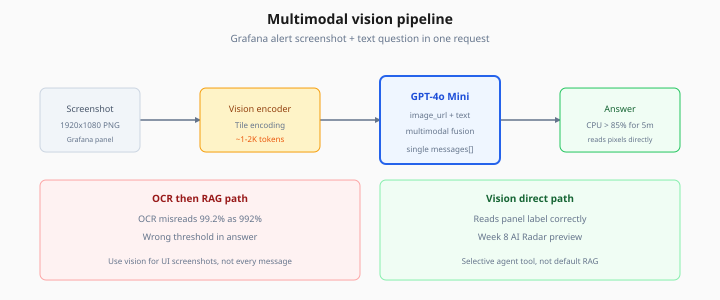
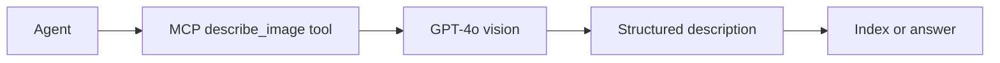

# Multimodal Preview — Vision + Text

> Week 7 Theory · Day 6 · [← README](../README.md) · Prev: [long-context-vs-rag](long-context-vs-rag.md) · Next: [mcp-production-patterns](mcp-production-patterns.md)

**Multimodal** models accept **images and text** in the same request — useful for diagrams, screenshots, receipts, and UI mockups. Week 7 is a preview for Week 8 **AI Radar** (screenshots of tool UIs, paper figures); you won't build a full vision pipeline this week.

---

## Concepts

### What problem are we solving?

Some information is inherently visual: architecture diagrams, chart trends, error dialog screenshots. Text-only RAG can't index what was never OCR'd well. Vision-capable models let you **ask questions about pixels** alongside your text corpus.

### Worked scenario: incident screenshot

**Input:** Slack screenshot of a Grafana alert + user question *"What threshold fired?"*

| Approach | Result |
|----------|--------|
| OCR → text RAG | OCR misreads "99.2%" as "992%" — wrong answer |
| GPT-4o vision direct | Reads panel: "CPU > 85% for 5m" — correct |



*Figure: Vision reads pixels directly — OCR-then-RAG misreads numbers; use vision selectively for UI screenshots.*

**Request shape (OpenAI):**

```json
{
  "model": "gpt-4o-mini",
  "messages": [{
    "role": "user",
    "content": [
      {"type": "text", "text": "What alert threshold fired?"},
      {"type": "image_url", "image_url": {"url": "data:image/png;base64,..."}}
    ]
  }]
}
```

### When to add vision (decision snippet)

| Use vision | Skip vision |
|------------|-------------|
| UI screenshots, diagrams | Pure text docs already in RAG |
| Low-structure PDFs (scanned) | Digital PDFs with good text layer |
| Quick ad-hoc analysis | High-volume batch (cost) |

### Cost and latency note

Images consume **many tokens** (tile-based encoding). A 1920×1080 screenshot might be 1K–2K+ tokens — compare to text chunk. Use vision ** selectively** in agent tools, not every message.

### Pattern: vision as MCP tool



Agent calls `describe_image` only when user attaches file — keeps default path text-only.

### AI engineer takeaway

Week 7 Lab 6 optional demo — one image Q&A. Week 8 AI Radar may use vision for tool landing pages; document cost in ADR if enabled.

---

## Tradeoffs

| Pros | Cons |
|------|------|
| Handles non-text sources | Higher $/request |
| No OCR pipeline | Privacy — images may contain PII |
| Fast to prototype | Harder to eval reproducibly |

---

## Best Practices

1. **Resize images** before API — max dimension 2048px typical.
2. **Redact PII** in logs — don't store raw screenshots in traces.
3. **Structured output** — ask for JSON `{summary, entities, numbers}`.
4. **Fallback** — if no image attached, text-only path.

---

## Checkpoint

1. Why did OCR+RAG fail on the Grafana screenshot?
2. Name two content types that favor vision over text RAG.
3. Why shouldn't every chat message send images to the model?

---

## Go Deeper

| Resource | Why |
|----------|-----|
| [OpenAI vision guide](https://platform.openai.com/docs/guides/vision) | Message format |
| [Claude vision](https://docs.anthropic.com/en/docs/build-with-claude/vision) | Alternative provider |

---

## Next

Continue Day 6: [mcp-production-patterns.md](mcp-production-patterns.md) → [Lab 6](../labs/lab-06-mcp-production.md)
