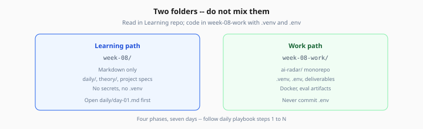

# Week 8 — Start Here (Capstone)

> One-time orientation · then live in [daily/day-01.md](daily/day-01.md)

**Prerequisite:** Complete Weeks 1–7 exit criteria (RAG, agents, production stack, eval, advanced topics) before starting the capstone.

---

## 1. Setup (once)

```bash
cd Learning/week-08
chmod +x scripts/setup-work.sh
./scripts/setup-work.sh
```

Add to `.env` in your work dir:

- `OPENAI_API_KEY`
- `GITHUB_TOKEN`
- `TAVILY_API_KEY` or `BRAVE_SEARCH_API_KEY`
- `DATABASE_URL` (Postgres + pgvector — Docker on Day 1)
- `REDIS_URL` (Day 5+)
- Email: `RESEND_API_KEY` or SMTP settings (Day 6+)

Never commit `.env`.

Optional: copy reusable modules from `~/ai-learning/week-03-work/` through `week-07-work/` (see [project/overview.md](project/overview.md)).

---

## 2. Your two folders

| | Where | What you do |
|---|--------|-------------|
| **Learning path** | `Learning/week-08/` | Read playbooks, theory, project specs |
| **Work path** | `week-08-work/` or `~/ai-learning/week-08-work/` | Python, Next.js, `ai-radar/`, eval artifacts |



*Figure: Read curriculum in `week-08/` — code and secrets live only in `week-08-work/`.*

---

## 3. Four phases, seven days

| Phase | Days | You ship |
|-------|------|----------|
| 1 Foundation | 1–2 | Ingestion + pgvector corpus |
| 2 Intelligence | 3–4 | LangGraph + MCP + agentic RAG |
| 3 Product | 5–6 | Dashboard + cache + email digest |
| 4 Production | 7 | Eval CI + Docker + portfolio |

Full specs: [project/phases/](project/phases/)

---

## 4. Every study session

```
Open daily/day-XX.md  →  follow steps 1…N  →  tick progress.md  →  Tomorrow link
```

Do **not** read all nine theory files before Day 1. The daily playbook links only what you need that day.

**Catch-up:** lab/build steps + deliverables only; skim theory Concepts + takeaway.

---

## 5. First step

**→ [Day 1 playbook — Phase 1: Foundation](daily/day-01.md)**
