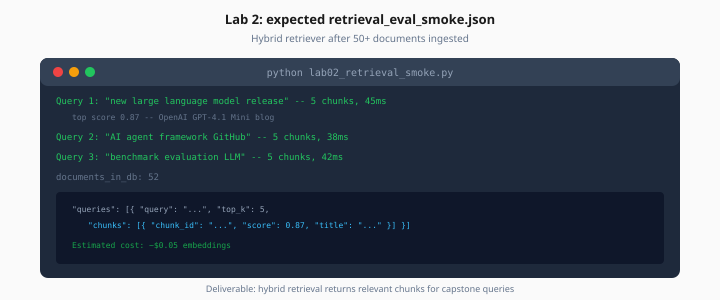

# Lab 2: pgvector Retrieval Smoke

> Week 8 Labs · Day 2 · [← README](README.md) · [pgvector theory](../theory/pgvector-redis-caching.md)

> **Work dir:** `~/ai-learning/week-08-work/`

**Estimated cost:** ~$0.05 embeddings for 50 docs

**Goal:** After ingestion + embed pipeline, hybrid retrieval returns relevant chunks for capstone test queries.



*Figure: Three fixed test queries — each returns top-k chunks with scores after 50+ docs ingested.*

---

## Task

Create `lab02_retrieval_smoke.py` that:

1. Assumes ≥ 50 documents already ingested (run `python -m app.jobs.run_ingestion` first)
2. Runs 3 test queries through hybrid retriever
3. Writes `artifacts/retrieval_eval_smoke.json`

### Test queries (fixed)

```
1. "new large language model release"
2. "AI agent framework GitHub"
3. "benchmark evaluation LLM"
```

### Expected output

```json
{
  "queries": [
    {
      "query": "new large language model release",
      "top_k": 5,
      "chunks": [
        {"chunk_id": "...", "score": 0.87, "title": "...", "url": "..."}
      ],
      "latency_ms": 45
    }
  ],
  "documents_in_db": 52
}
```

---

## Acceptance

- [ ] `documents_in_db` ≥ 50
- [ ] Each query returns 5 chunks with scores
- [ ] p95 latency < 500ms locally
- [ ] At least one chunk per query has sensible title (manual skim)

---

## Next

[Day 3](../daily/day-03.md) → [Lab 3](lab-03-langgraph-mcp.md)
