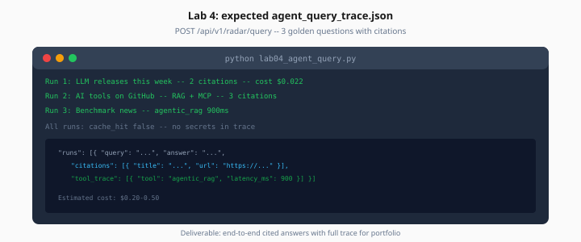

# Lab 4: Agentic RAG Query

> Week 8 Labs · Day 4 · [← README](README.md) · [Agentic RAG](../theory/agentic-rag-patterns.md)

> **Work dir:** `~/ai-learning/week-08-work/ai-radar/`

**Estimated cost:** $0.20–0.50 (3 full agentic queries)

**Goal:** End-to-end cited answers via API with full trace for portfolio.



*Figure: Three golden questions — each run includes citations, tool trace, and cost.*

---

## Task

Run `lab04_agent_query.py` (or curl script) against `POST /api/v1/radar/query` with 3 golden questions:

1. `"What LLM or model releases appear in the corpus this week?"`
2. `"What AI tools or frameworks were highlighted on GitHub?"`
3. `"Summarize any benchmark or evaluation news."`

Write `artifacts/agent_query_trace.json`:

```json
{
  "runs": [
    {
      "query": "...",
      "answer": "...",
      "citations": [{"title": "...", "url": "..."}],
      "tool_trace": [{"tool": "agentic_rag", "latency_ms": 900}],
      "cache_hit": false,
      "cost_usd": 0.022
    }
  ]
}
```

---

## Acceptance

- [ ] 3 runs in JSON
- [ ] Each run has ≥ 1 citation with valid URL
- [ ] At least one run used both RAG and MCP OR documents strategy in trace
- [ ] No secrets in trace

---

## Next

[Day 5](../daily/day-05.md) → [Lab 5](lab-05-redis-semantic-cache.md)
