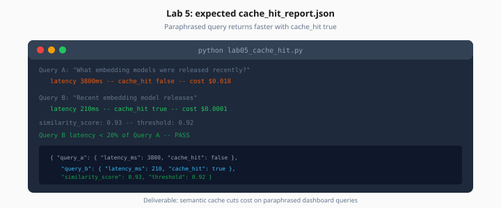

# Lab 5: Redis Semantic Cache

> Week 8 Labs · Day 5 · [← README](README.md) · [Cache theory](../theory/pgvector-redis-caching.md)

> **Work dir:** `~/ai-learning/week-08-work/ai-radar/`

**Estimated cost:** ~$0.03 (one agent call + one cache hit)

**Goal:** Second paraphrased query returns faster with `cache_hit: true`.



*Figure: Query B latency under 20% of Query A — similarity above 0.92 threshold.*

---

## Task

Create `lab05_cache_hit.py`:

1. Query A: `"What embedding models were released recently?"`
2. Query B: `"Recent embedding model releases"` (paraphrase)
3. Write `artifacts/cache_hit_report.json`

### Expected output

```json
{
  "query_a": {"latency_ms": 3800, "cache_hit": false, "cost_usd": 0.018},
  "query_b": {"latency_ms": 210, "cache_hit": true, "cost_usd": 0.0001},
  "similarity_score": 0.93,
  "threshold": 0.92
}
```

---

## Acceptance

- [ ] Query B `cache_hit` is true
- [ ] Query B latency < 20% of Query A
- [ ] Similarity ≥ configured threshold

---

## Troubleshooting

| Symptom | Fix |
|---------|-----|
| Never hits | Lower threshold to 0.90 |
| False hits | Raise threshold; include model version in cache key |

---

## Next

[Day 6](../daily/day-06.md) → [Lab 6](lab-06-email-digest-scheduler.md)
