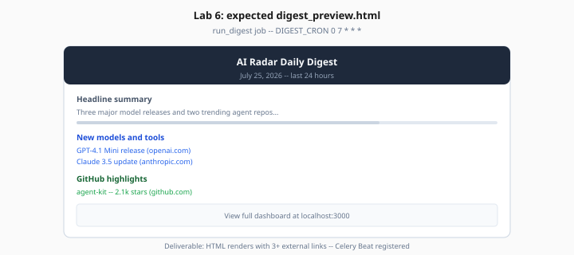

# Lab 6: Email Digest + Scheduler

> Week 8 Labs · Day 6 · [← README](README.md) · [Scheduling](../theory/ingestion-scheduling.md)

> **Work dir:** `~/ai-learning/week-08-work/ai-radar/`

**Estimated cost:** $0.05–0.15 (one digest summarization)

**Goal:** Digest job produces HTML preview; optional live email.



*Figure: Headline summary, model sections, GitHub highlights — 3+ external links required.*

---

## Task

```bash
cd ~/ai-learning/week-08-work/ai-radar/backend
python -m app.jobs.run_digest --output ../artifacts/digest_preview.html
```

Verify scheduler registered:

```bash
# Celery beat schedule list or APScheduler job registry
python -c "from app.jobs.celery_app import beat_schedule; print(beat_schedule)"
```

---

## Expected HTML sections

- Headline summary (≥ 100 words)
- New models & tools
- GitHub highlights
- Papers / benchmarks (if data exists)
- Footer with link to dashboard

---

## Acceptance

- [ ] `digest_preview.html` renders in browser
- [ ] Contains ≥ 3 external links
- [ ] `DIGEST_CRON` documented in README
- [ ] Email sent OR note in progress.md why skipped (SMTP blocked)

---

## Next

[Day 7](../daily/day-07.md) → [Lab 7](lab-07-eval-ci-gate.md) *(optional)*
