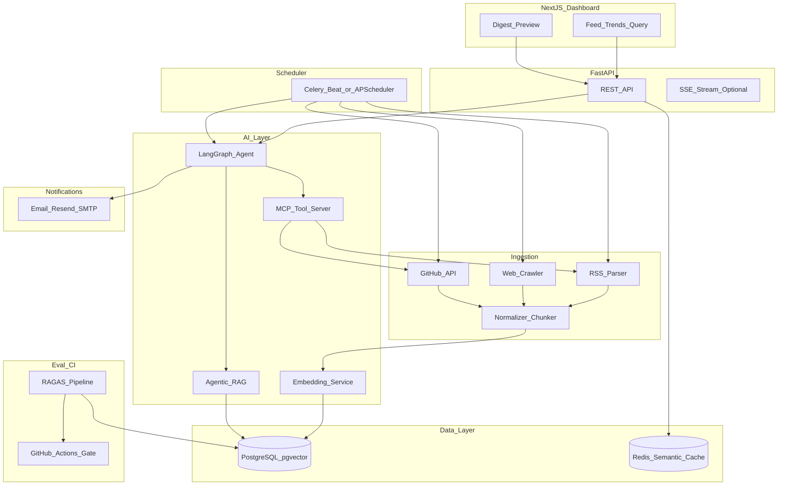
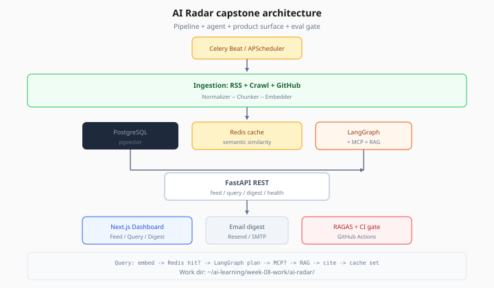

# AI Radar — Architecture

> Week 8 Capstone · [Overview](overview.md)

> **Work dir:** `~/ai-learning/week-08-work/ai-radar/`

This page is the single source of truth for **how components connect**. Implementation details live in [backend.md](backend.md) and [frontend.md](frontend.md).

---

## System Diagram





*Figure: Full component diagram — memorize query path and cache placement for interviews.*

---

## Data Flow (query path)

1. User asks on dashboard: *"New LLM releases this week?"*
2. FastAPI checks **Redis semantic cache** (embedding similarity ≥ 0.92 → return cached answer).
3. Cache miss → **LangGraph agent** runs: plan → maybe call MCP **web search** → maybe **agentic RAG** over pgvector → synthesize with citations.
4. Response stored in cache + returned to UI with `sources[]` and `tool_trace[]`.

---

## Folder Structure

```
ai-radar/
├── docker-compose.yml
├── Makefile
├── README.md                         # per github-readme-spec.md
├── config/
│   ├── sources.yaml                  # RSS feeds, crawl seeds, GitHub queries
│   ├── agent.yaml                    # LangGraph node config
│   └── eval_golden.yaml              # RAGAS golden Q&A
├── docs/
│   ├── architecture.md               # copy/export from curriculum
│   └── adr/
│       └── 001-agentic-rag-vs-static.md
├── artifacts/                        # gitignored except samples
│   ├── rag_eval_report.json
│   ├── agent_query_trace.json
│   └── digest_preview.html
├── frontend/
│   ├── app/
│   │   ├── page.tsx                  # feed + trends
│   │   ├── query/page.tsx            # agent Q&A
│   │   └── digest/page.tsx           # digest preview
│   ├── components/
│   │   ├── FeedList.tsx
│   │   ├── TrendChart.tsx
│   │   ├── QueryPanel.tsx
│   │   └── SourceCitations.tsx
│   └── lib/api.ts
├── backend/
│   ├── app/
│   │   ├── main.py
│   │   ├── config.py
│   │   ├── api/
│   │   │   ├── routes_feed.py
│   │   │   ├── routes_query.py
│   │   │   ├── routes_digest.py
│   │   │   └── routes_health.py
│   │   ├── agents/
│   │   │   ├── graph.py              # LangGraph definition
│   │   │   ├── nodes.py
│   │   │   ├── state.py
│   │   │   └── agentic_rag.py
│   │   ├── mcp/
│   │   │   ├── server.py             # MCP tool server
│   │   │   └── tools/
│   │   │       ├── search.py
│   │   │       ├── rss.py
│   │   │       └── github.py
│   │   ├── ingestion/
│   │   │   ├── rss_fetcher.py
│   │   │   ├── crawler.py
│   │   │   ├── github_sync.py
│   │   │   └── pipeline.py
│   │   ├── rag/
│   │   │   ├── embedder.py
│   │   │   ├── store.py              # pgvector
│   │   │   └── retriever.py
│   │   ├── cache/
│   │   │   └── semantic.py           # Redis
│   │   ├── jobs/
│   │   │   ├── celery_app.py
│   │   │   ├── run_ingestion.py
│   │   │   └── run_digest.py
│   │   ├── notifications/
│   │   │   └── email.py
│   │   ├── eval/
│   │   │   ├── run_ragas.py
│   │   │   └── thresholds.py
│   │   └── db/
│   │       ├── models.py
│   │       └── session.py
│   ├── alembic/
│   ├── tests/
│   │   ├── unit/
│   │   ├── integration/
│   │   └── eval/
│   └── pyproject.toml
├── mcp-server/                       # optional standalone MCP process
│   └── pyproject.toml
├── .github/
│   └── workflows/
│       └── eval-gate.yml
├── .env.example
└── .gitignore
```

---

## Key Design Decisions

| Decision | Why | Alternative rejected |
|----------|-----|----------------------|
| LangGraph for orchestration | Stateful agent loops, checkpoints, observable tool steps | Raw ReAct loop — harder to resume/debug |
| Agentic RAG (agent decides retrieve) | Queries like "trends this week" need multi-hop reasoning | Always-retrieve — noisy context, stale answers |
| MCP for tools | Standard tool protocol; swap search provider without graph rewrite | Hard-coded httpx calls in every node |
| pgvector in Postgres | One DB for metadata + vectors; Week 3 production path | Separate vector DB — ops overhead for capstone |
| Redis semantic cache | Cut duplicate agent cost on similar dashboard queries | Exact-string cache — misses paraphrases |
| Celery Beat scheduler | Production cron pattern from Week 5 | OS cron only — no retry/visibility |
| RAGAS CI gate | Blocks faithfulness regressions before merge | Manual spot-check — not portfolio-grade |

---

## Entity Model (simplified)

| Table | Purpose |
|-------|---------|
| `sources` | RSS URL, GitHub query, crawl seed metadata |
| `documents` | Normalized title, url, published_at, raw text |
| `chunks` | Chunk text + `embedding vector(1536)` |
| `ingestion_runs` | Job id, counts, errors, duration |
| `digests` | Date, summary markdown, item ids |
| `query_logs` | User query, answer, citations, cost_usd |

---

## AI engineer takeaway

Capstone architecture is a **pipeline + agent + product surface + eval gate**. Interviewers care that you can draw this diagram, explain cache placement, and justify agentic RAG over static retrieval.
