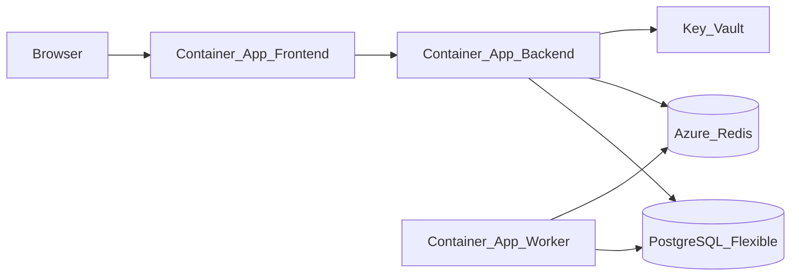

# AI Radar — Azure Deployment (Optional)

> Week 8 Capstone · **Optional — not required for exit criteria** · [Docker](docker.md)

Deploy AI Radar to Azure when you want a **live demo URL** on your resume. Local Docker Compose is sufficient for Week 8 completion.

---

## Recommended path: Container Apps

| Azure resource | Maps to |
|----------------|---------|
| Container Apps Environment | Hosts backend + worker |
| Container App `ai-radar-api` | FastAPI |
| Container App `ai-radar-worker` | Celery worker |
| Azure Database for PostgreSQL Flexible Server | pgvector (enable extension) |
| Azure Cache for Redis | Semantic cache |
| Container Registry (ACR) | Docker images |
| Key Vault | API keys (OpenAI, GitHub, Resend) |

---

## Architecture on Azure

---

## pgvector on Azure Postgres

1. Create Flexible Server (PostgreSQL 16+)
2. Allow extension: `azure.extensions = VECTOR`
3. Connect and run: `CREATE EXTENSION IF NOT EXISTS vector;`

---

## Deploy steps (high level)

1. Build and push images to ACR
2. Create Postgres + Redis in same region
3. Deploy backend Container App with env from Key Vault references
4. Deploy worker with same env + Celery broker URL
5. Deploy frontend with `NEXT_PUBLIC_API_URL` = backend ingress URL
6. Run migration job once
7. Trigger ingestion via admin endpoint or scheduled job

Use `az containerapp` CLI or Bicep — Week 5 patterns apply.

---

## Cost estimate (Azure)

| Resource | Dev SKU | ~Monthly |
|----------|---------|----------|
| Container Apps (2 apps) | 0.5 vCPU, 1Gi | $15–30 |
| PostgreSQL Flexible | Burstable B1ms | $15–25 |
| Redis Basic C0 | 250MB | $16 |
| **Total** | | **$45–70** |

**Tip:** Tear down after demo week to avoid ongoing charges.

---

## Email on Azure

Use **Resend** or **Azure Communication Services Email** — SMTP from Container Apps requires outbound rules.

---

## AI engineer takeaway

Optional Azure proves you can move from Compose to managed services. Mention **Key Vault + managed identity** in interviews.

---

## Back to required path

[Docker Compose](docker.md) · [Exit criteria](../checkpoints/exit-criteria.md)
