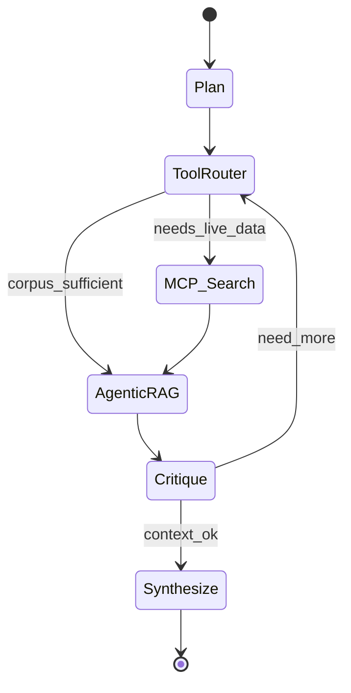

# Phase 2 — Intelligence (Days 3–4)

> [← Phase 1](phase-1-foundation.md) · [Phase 3 →](phase-3-product.md)

> **Work dir:** `~/ai-learning/week-08-work/ai-radar/`

**Goal:** A LangGraph agent that orchestrates MCP tools (search, RSS, GitHub) and performs **agentic RAG** — deciding when to retrieve from pgvector vs call live tools — returning cited answers via API.

---

## Day 3 Deliverables

| Artifact | Description |
|----------|-------------|
| LangGraph `graph.py` | Nodes: plan → tool_router → synthesize |
| MCP tool server | search, rss_lookup, github_search exposed |
| `mcp_tool_trace.json` | Lab 3 — tool calls with inputs/outputs |
| Checkpointing | Sqlite or Postgres checkpointer (resume after crash) |

### Day 3 tasks

1. Read [langgraph-orchestration.md](../../theory/langgraph-orchestration.md) + [mcp-tool-integration.md](../../theory/mcp-tool-integration.md)
2. Define agent state: `messages`, `retrieved_docs`, `tool_calls`, `final_answer`
3. Implement MCP tools wrapping existing ingestion clients
4. Run [Lab 3](../../labs/lab-03-langgraph-mcp.md)

---

## Day 4 Deliverables

| Artifact | Description |
|----------|-------------|
| `agentic_rag.py` | Retrieve node with self-critique ("enough context?") |
| `POST /api/v1/radar/query` | JSON in/out with citations |
| `agent_query_trace.json` | Lab 4 — full trace for sample queries |
| ADR | `docs/adr/001-agentic-rag-vs-static.md` (1 page) |

### Day 4 tasks

1. Read [agentic-rag-patterns.md](../../theory/agentic-rag-patterns.md)
2. Add conditional edges: if plan says "corpus-only" → RAG; if "breaking news" → MCP search first
3. Enforce citation format: `[title](url)` per claim
4. Run [Lab 4](../../labs/lab-04-agentic-rag-query.md)

---

## Sample query API

**Request:**

```json
{
  "query": "What open-source agent frameworks launched on GitHub this month?",
  "mode": "agentic"
}
```

**Response:**

```json
{
  "answer": "Three notable launches: ...",
  "citations": [
    {"title": "LangGraph 0.3 release", "url": "https://...", "chunk_id": "abc"}
  ],
  "tool_trace": [
    {"tool": "github_search", "input": {"q": "agent framework"}, "latency_ms": 420}
  ],
  "cost_usd": 0.018,
  "cache_hit": false
}
```

---

## Phase 2 Acceptance

- [ ] Agent completes ≥ 3 golden queries without human intervention
- [ ] Every factual sentence in answer maps to ≥ 1 citation
- [ ] MCP tools callable from graph (search + GitHub minimum)
- [ ] Agentic path skips retrieval when MCP returns fresh results
- [ ] `agent_query_trace.json` checked into `artifacts/` (sample, no secrets)

---

## Graph sketch



---

## Next

**→ [Phase 3 — Product](phase-3-product.md)** · [Day 5 playbook](../../daily/day-05.md)
