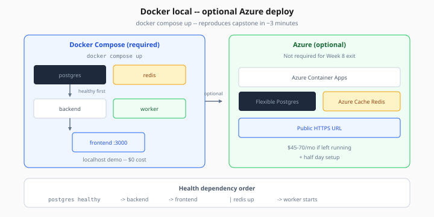

# Docker + Azure Deployment

> Week 8 Theory · Day 7 · [← eval-ci-gates](eval-ci-gates.md)

**Docker Compose** packages AI Radar so anyone can boot Postgres, Redis, backend, worker, and frontend with one command. **Azure** is optional proof you can deploy to managed cloud — not required to finish Week 8.

---

## What problem are we solving?

"It works on my machine" fails interviews. Docker gives reproducible demos; Azure shows you understand managed Postgres, Redis, and Container Apps.

### Worked scenario

Clone repo → `docker compose up` → 3 minutes later interviewer hits `:3000` feed with real data after `run_ingestion`. README documents exact steps — [github-readme-spec.md](../project/github-readme-spec.md).

---

## Concepts

### Compose services (required)

postgres (pgvector), redis, backend, worker, frontend — see [docker.md](../project/docker.md).



*Figure: `docker compose up` boots all services in dependency order — Azure is optional proof of cloud deploy.*

### Health dependency order

```
postgres healthy → backend starts → frontend starts
redis up → worker starts
```

### Azure optional path

Container Apps + Flexible Postgres (pgvector extension) + Azure Cache for Redis. See [azure.md](../project/azure.md).

**Optional — not required for Week 8 exit criteria.**

---

## Tradeoffs

| | Docker local | Azure |
|---|--------------|-------|
| Cost | $0 | $45–70/mo if left running |
| Demo URL | localhost / ngrok | Public HTTPS |
| Setup time | Hours | + half day |

---

## Best practices

- `.dockerignore` — exclude `.venv`, `node_modules`
- Healthchecks on every service
- Secrets via env / Key Vault — never in images
- Document teardown to avoid Azure bill shock

---

## Common mistakes

| Mistake | Fix |
|---------|-----|
| pgvector extension missing | Use official pgvector image |
| Worker cannot reach Redis | Same Docker network |
| Frontend baked wrong API URL | Build-time env for Compose |

---

## Checkpoint

1. Name five Compose services.
2. Why separate worker container?
3. Is Azure required for Week 8?
4. What healthcheck validates Postgres ready?
5. Two README sections for deploy per github-readme-spec?

---

## Go deeper

| Resource | Why |
|----------|-----|
| [docker.md](../project/docker.md) | Full compose file |
| [azure.md](../project/azure.md) | Optional cloud |
| [acceptance-criteria.md](../project/acceptance-criteria.md) | Ship checklist |

---

## Next

[eval.md](../project/eval.md) → [Lab 7](../labs/lab-07-eval-ci-gate.md) → complete [Day 7](../daily/day-07.md) → **program complete**
