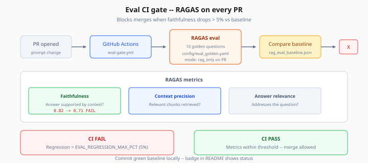

# Eval CI Gates

> Week 8 Theory · Day 7 · [← nextjs-dashboard-patterns](nextjs-dashboard-patterns.md) · Next: [docker-azure-deployment](docker-azure-deployment.md)

**RAGAS** scores how trustworthy your RAG answers are. A **CI gate** runs those scores on every pull request and blocks merges when quality drops — the difference between a demo and a production-minded capstone.

---

## What problem are we solving?

You change the synthesize prompt and answers **sound** better but hallucinate more. Without eval, you will not notice until an interviewer asks for sources. CI automates that check.

### Worked scenario

PR changes agent prompt. GitHub Actions runs 10 golden questions. Faithfulness drops from **0.82 → 0.71** (> 5% regression). CI fails. You fix prompt or update golden set with justification.

---

## Concepts

### RAGAS metrics (plain language)

| Metric | Question it asks |
|--------|------------------|
| **Faithfulness** | Is the answer supported by retrieved context? |
| **Context precision** | Did retrieval fetch relevant chunks? |
| **Answer relevance** | Does the answer address the question? |

### Golden dataset

`config/eval_golden.yaml` — minimum 10 Q&A pairs tied to your corpus categories (models, GitHub, papers).

Regenerate ground truth when corpus shifts significantly.

### CI gate logic

```
current_metrics vs baseline (artifacts/rag_eval_baseline.json)
fail if any metric drops > EVAL_REGRESSION_MAX_PCT (default 5%)
fail if any metric below absolute minimum (.env thresholds)
```



*Figure: Faithfulness drop from 0.82 to 0.71 blocks merge — commit a green baseline before opening PRs.*

### Cost control in CI

Use `mode: rag_only` for PR checks; full agentic eval on `main` nightly (optional).

---

## Tradeoffs

| | CI on every PR | Manual eval |
|---|----------------|-------------|
| Safety | High | Low |
| Cost / time | $1–2 per run | Free but skipped |
| Flake risk | LLM variance — use thresholds | Same |

Run eval twice and take median if flaky (optional).

---

## Best practices

- Commit baseline only from known-good `main`
- Badge in README — social proof
- Store `rag_eval_report.json` as CI artifact

---

## Common mistakes

| Mistake | Fix |
|---------|-----|
| Golden set never updated | Monthly refresh |
| Threshold 0.95 — always fails | Start 0.75 faithfulness |
| Eval without seeded DB | CI loads test fixtures |

---

## Checkpoint

1. What does faithfulness measure?
2. What triggers CI failure — two conditions?
3. Where is the golden dataset stored?
4. Why `rag_only` mode in CI?
5. What file is the regression baseline?

---

## Go deeper

| Resource | Why |
|----------|-----|
| [eval.md](../project/eval.md) | Pipeline spec |
| [Lab 7](../labs/lab-07-eval-ci-gate.md) | Workflow setup |
| [RAGAS docs](https://docs.ragas.io/) | Metric details |

---

## Next

[docker-azure-deployment.md](docker-azure-deployment.md) → [Day 7 playbook](../daily/day-07.md)
