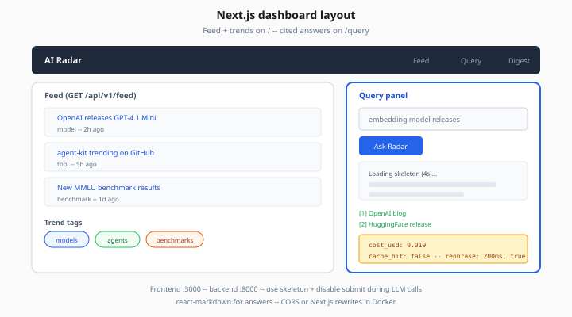

# Next.js Dashboard Patterns

> Week 8 Theory · Day 5 · [← agentic-rag-patterns](agentic-rag-patterns.md) · Next: [eval-ci-gates](eval-ci-gates.md)

The dashboard is how interviewers **see** your capstone in 30 seconds: a feed of ingested AI news, trend tags, and a query box that returns cited answers.

---

## What problem are we solving?

APIs alone do not demo well on a phone screen share. A minimal Next.js UI proves you can ship full-stack AI products — not just notebooks.

### Worked scenario

Interviewer opens `localhost:3000`. Feed shows 20 items from today's ingestion. They type *"embedding model releases"* in Query — loading spinner 4s — markdown answer with 3 clickable citations. Metrics bar: `cost_usd: 0.019`, `cache_hit: false`. They rephrase — 200ms, `cache_hit: true`.

---

## Concepts

### App Router pages

| Route | Data source |
|-------|-------------|
| `/` | `GET /api/v1/feed`, `GET /api/v1/trends` |
| `/query` | `POST /api/v1/radar/query` |
| `/digest` | `GET /api/v1/digest/latest` |

*Figure: Feed and trends on `/` — query panel shows loading skeleton, citations, and `cost_usd` / `cache_hit` metrics.*

### UX patterns for slow LLM calls

| Pattern | Use |
|---------|-----|
| Loading skeleton | Query panel — avoid blank 8s |
| Optimistic disable | Disable submit while pending |
| Error banner | Backend down / 429 budget |
| Markdown render | `react-markdown` for answers |

### CORS + env

Frontend on `:3000`, backend on `:8000` — enable CORS in FastAPI or use Next.js rewrites in production Docker.

---

## Tradeoffs

| | Server components | Client fetch |
|---|-------------------|--------------|
| Feed list | Good SSR | Client OK for capstone |
| Query panel | Must be client | Interactive |

Keep query page client-side (`"use client"`) for form state.

---

## Best practices

- Show citations below answer — trust signal
- Display `cache_hit` and `cost_usd` — shows cost awareness
- Mobile-friendly feed cards — optional polish

---

## Common mistakes

| Mistake | Fix |
|---------|-----|
| `NEXT_PUBLIC_API_URL` wrong in Docker | Set per environment |
| Rendering raw HTML unsafely | Sanitize digest HTML |
| No empty state | "Run ingestion" CTA when feed empty |

---

## Checkpoint

1. Name three dashboard routes and their APIs.
2. Why loading state matters for LLM queries?
3. Where do citations render?
4. What env var points frontend to backend?
5. Symptom: empty feed — two possible causes?

---

## Go deeper

| Resource | Why |
|----------|-----|
| [frontend.md](../project/frontend.md) | Component spec |
| [Lab 5](../labs/lab-05-redis-semantic-cache.md) | Cache demo from UI |
| [Next.js docs](https://nextjs.org/docs) | App Router |

---

## Next

Skim Redis section of [pgvector-redis-caching.md](pgvector-redis-caching.md) → [Lab 5](../labs/lab-05-redis-semantic-cache.md) → [Day 6](../daily/day-06.md)
